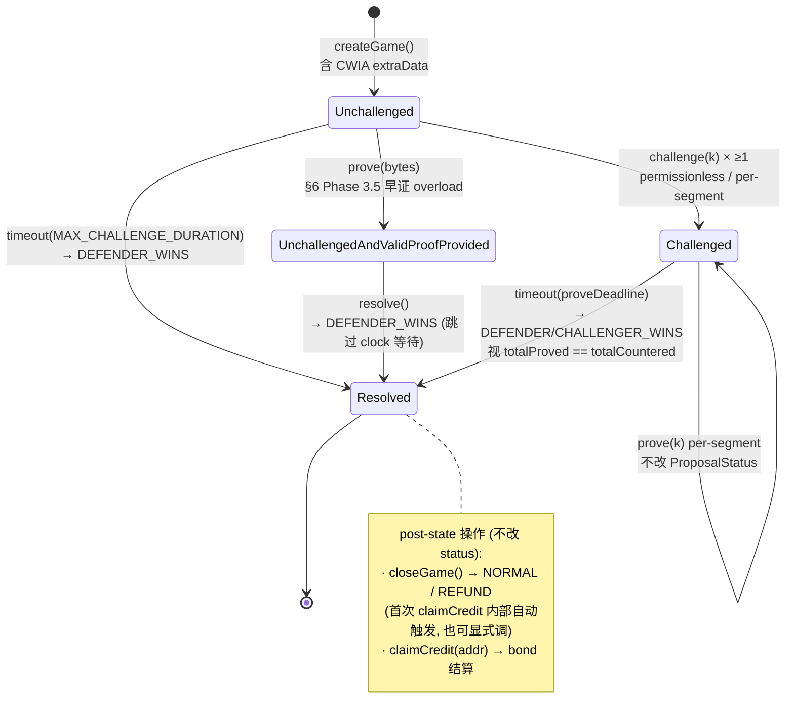

# op-succinct TZ fault dispute game V2 设计原理

> **TL;DR** — V2 在 V1 「单段全证」基础上引入「分段交互式挑战 + 中间 root calldata DA + 多 challenger 抗 griefing」三件套：
>
> - **分段**让单次 prove 跨度可控，settle 周期 ≈ 单段 prove 耗时 + 一个挑战期，不再被整 batch 长度拖死
> - **中间 root 强制 calldata 公开**（createGame 时一次提交）让 challenger 不依赖 off-chain DA 也能定位错误段并构造 prove
> - **多 challenger / 同段**用 per-challenger bond ledger 防 single-attacker 抢位 griefing
>
> 关键折中：**calldata 而非 blob**。在「分相对粗段也能及时 prove 完成」的假设下 calldata 足够便宜（实测折点 N ≈ 20 段）；blob 方案已端到端验证可行（blob-kzg-demo/），但客户端复杂度更高，当前阶段不引入，留作 N 稳定 > 20 段时的退路。

---

## 术语

| 术语 | 含义 |
|---|---|
| **段 (segment)** | 一段连续 L2 block 区间。Propose 时一次性提交 N 段 |
| **中间 root** | 第 k 段终点 = 第 k+1 段起点的 L2 output root。Propose 时随 calldata 公开 |
| **ProposalStatus** | 本 spec 4 态：`Unchallenged` / `Challenged` / `UnchallengedAndValidProofProvided` / `Resolved`（两条迁移路径，详 §3 状态机） |
| **S 集合** | `{ k | 段 k 已被 challenge 但未被 prove }`（spec §9.3） |
| **L 段** | 已被 prove 通过的段（spec §9.3 L = "Lost from challenger view"） |
| **bond ledger** | 合约内部按 (gameId, segment, challenger) 维度的 credit 账本 |
| **CWIA** | Clone-With-Immutable-Args，Solady 模式，calldata 尾部挂 game 静态参数 |
| **CHW** | "Challenger has Won" — 父 game challenger win，整个子树不可信 |

---

## 背景

### V1 单证模型
V1 OPSuccinctFaultDisputeGame 沿 OP-stack fault dispute game 模型：**一个 game 对应一个 outputRoot 提议，整 batch 跨度只有一个 claim**。挑战流程是 challenger 提交整体质疑，proposer 在挑战期内交一个覆盖整 batch 的 SP1 proof，否则 defender 输。

### TZ 场景的不适用点
TZ 希望 **prove 耗时不锁死 settle 周期**：单段 prove 时间 T 应该 ≪ 挑战期。但 V1 模型下 prove 必须覆盖整 batch（B 个 block），单次 prove 时长随 B 线性增长 — batch 越长 settle 越被推远，对争议解决与跨链消息延迟都是硬约束。

---

## 1. 核心 trade-off：分段 + 中间 root DA

### 1.1 分段：交互式挑战不需要全证

**观察**：挑战合约本身就是交互式的 — challenger 已经声明「第 X 段是错的」，那 prove 阶段只需要证明「第 X 段是对的」就够，**没必要为整 batch 重算一份大 proof**。

**收益**：
- 单次 prove 跨度 = 一个段（而非整 batch）
- 多段 prove 可独立并发
- Settle 周期 ≈ max(单段 prove 时间, 挑战期) + 资金清算，不再被全 batch 长度卡死

**成本**：合约要表达「N 个段 + 每段独立可质疑 + 每段独立 prove deadline + 每段独立 bond ledger」 — 状态空间相对 V1 翻一档（详见 §3 状态机、§4 资金流）。

> **核心判断**：合约复杂度的一次性投入，换 settle 周期的持续性缩短，对 TZ 这种争议高频场景值得做。

### 1.2 分段后立刻撞上的 DA 难题

第 k 段的「起点 root」就是第 k-1 段的「终点 root」（即中间 root）。如果中间 root 只放在 off-chain：

> Challenger 想质疑第 k 段，必须先拿到第 k-1 段的终点 root — 拿不到就无法构造质疑，更无法对照 prove。

这相当于把链上裁决权交给了 off-chain DA 的可用性。**链上合约必须能拿到所有中间 root**，否则就出现"谁都没错但链上裁决不了"的死锁。

### 1.3 DA 方案选择：calldata vs blob

两条路径：

| 方案 | 机制 | 代价（设 N 段、中间 root 32B） |
|---|---|---|
| **A. calldata 全量公开** | createGame 时把 N-1 个中间 root 写进 CWIA extraData | **~6.4K gas / root**（理论 200 gas/byte × 32B = 6,400；实测 N=4 marginal 6,350 / N=256 marginal 6,653） N=10 → ~58K gas；N=50 → ~313K gas；N=256 → +1.70M gas（实测 Δ） |
| **B. blob (EIP-4844)** | 中间 root 写 blob，KZG commitment 上链 | 固定 ~80-120K gas + blob fee（估算，未实测；与 N 无关） |

实测来源（contracts/test/fp/TZOPSuccinctFaultDisputeGameGas.t.sol，base = N=1 即 V1-equivalent CWIA，无中间 root）：

| N | 总 gas | Δ vs N=1 | per root |
|---|---|---|---|
| 1 | 409,920 | — | baseline |
| 4 | 428,971 | +19,051 | ~6,350 |
| 256 | 2,106,582 | +1,696,662 | ~6,653 |

> 注：每 root marginal cost ~6.5K **不是 calldata 也不是 SSTORE**。CWIA 把 extraData 拼到 clone 的 runtime bytecode 末尾，读取通过 `CODECOPY` from runtime code — 不进 storage。
>
> 每多一个 32B root → bytecode 多 32 byte → CREATE deploy 多花 32 × 200 = **6,400 gas**，与实测吻合。
>
> 反过来 runtime 访问 root 用 `CODECOPY`（~3 gas/word）远低于 `SLOAD`（cold 2,100 / warm 100），prove/challenge 阶段每次读 root 都便宜 — V1 baseline 同 pattern。

**folding point** 在 N ≈ 18–20 段：再细分 blob 更便宜（线性 vs 固定开销的交叉点）。

### 1.4 折中：粗段 + calldata

**最终选择**：
- 分**相对粗**的段（不切太细）
- 中间 root 通过 **calldata** 在 createGame 时一次性公开

**核心假设**：**「相对粗段也能及时 prove 完成」** — 当 batch 跨度 / 单段 SP1 时长 ≪ 挑战期时，粗段已经满足收益，不需要靠 blob 把段切得更细。

> **blob 方案不是"将来想加才研究"而是已经验证可行**（参见 tz/blob-kzg 分支 blob-kzg-demo/ 端到端 PoC）。决策点是：客户端要做 blob 拉取 + KZG cell proof 生成 + blob 寿命跟踪，链下复杂度 ↑。当前阶段不必要。
>
> **触发切换的 trigger**：未来 batch 跨度让 N 稳定 > ~20 段（折点见 §1.3），或者粗段 prove 时长不再 ≪ 挑战期 — 那时切 blob，合约 calldata 接口预留兼容。

---

## 2. 多 challenger 同段挑战：抗 griefing

### 设计动机
V1 一个 game 只允许一个 challenger — 在 TZ 多段场景下会引入**抢位 griefing**：恶意 challenger 抢先占住某段，proposer 不交 proof 也不会被惩罚到 attacker，真 challenger 没法上场，整段卡死到挑战期满。

### V2 解法

- 同一 segment 可被多人独立 challenge，各自押 `CHALLENGE_BOND`
- Bond ledger 按 (gameId, segment, challenger) 三元组维度记账
- Prove 阶段：任一第三方 prover 的 SP1 proof 一旦验证通过，**该段所有 challenger 的 CHAL_BOND 进入 push-to-prover / refund 流程**（按 §4.3）
- 反之 prove deadline 未达：**lowest-S challenger 独占 CREATE_BOND**（winner-takes-all，详 §4.1 Case B），其余 S-path challenger 仅退回各自的 CHAL_BOND

---

## 3. 4-state ProposalStatus 状态机

V1 ProposalStatus 有 **5 态**（`Unchallenged` / `Challenged` / `UnchallengedAndValidProofProvided` / `ChallengedAndValidProofProvided` / `Resolved`）— 后两态服务于 single-challenger × 单 prove 路径的子分支。V2 砍掉 `ChallengedAndValidProofProvided`（因 multi-segment 下 prove(k) Step 4 即时 push CHAL_BOND，不需要 game-wide 中间态），**保留 `UnchallengedAndValidProofProvided`（同 V1 命名，V1 alignment-first）**，得到 **4 态**：

| 状态 | 含义 | 进入条件 |
|---|---|---|
| `Unchallenged` | 创建后无挑战 | createGame 之后 |
| `Challenged` | 至少一段被挑战 | 任意 segment 有 challenger |
| `UnchallengedAndValidProofProvided` | 无挑战 + 整 batch 一次性早证（`prove(bytes)` overload） | spec §6 Phase 3.5 |
| `Resolved` | 已结算，bond 流向已定 | resolve() 被调用 |

> **注意**：被挑战路径下 `prove(k)` 逐段证明 **不改 ProposalStatus**（保持 `Challenged`），只在 per-segment `disputes[k]` 上标记。`UnchallengedAndValidProofProvided` 只代表「无人 challenge + 整 batch 早证」这条独立路径。

> **图例**：节点是 **ProposalStatus**（本 spec 4 态）；箭头 label 中 `DEFENDER_WINS` / `CHALLENGER_WINS` 是 **GameStatus**（OP-stack `IDisputeGame` 3 态）。两者同步迁移：`resolve()` 把 ProposalStatus 推到 `Resolved`，同时把 GameStatus 从 `IN_PROGRESS` 推到 DEFENDER_WINS/CHALLENGER_WINS。

> **parent-forced CHW**（详见 §4.1）：任意时刻父 game `CHALLENGER_WINS` → bypass 正常分支直接推到 `Resolved + CHALLENGER_WINS`，覆盖上图任何 transition。

**引入 U+VP 中间态的意义**：让 closeGame / setAnchor 可以**提前触发**（不必等挑战期满）— 无挑战 + 整 batch 早证 = defender 提前赢，无意义再等挑战期窗口。V2 沿用 V1 的 U+VP 命名而不重新发明，让 V1↔V2 对照阅读时无 mental translation 成本。

---

## 4. 资金流要点（简化版）

完整 8 case 二维表（NORMAL/REFUND × parent-CHW yes/no × challenger 输/赢）见 SPEC_GAME_V2_CALLDATA.md §9.4。这里只挑 **3 个最容易被设计直觉误判** 的：

### 4.1 Parent-CHW 时 CREATE_BOND：burn iff S = ∅

父 game 被 challenger win（parent-CHW）→ 整个子树不可信，本 game 强制走 `CHALLENGER_WINS`。CREATE_BOND 去向看 **S 集合**（已 challenge 但未 prove 的段）：

| 子状态 | S | NORMAL CREATE_BOND 去向 |
|---|---|---|
| Case A：N=0（无人挑战 / UnchallengedAndValidProofProvided） | ∅ | **burn → address(0)** |
| Case B：N>0, P<N（部分段未证） | ≠ ∅ | → **lowest-S challenger**（lazy compute via claimCredit） |
| Case C：N>0, P=N（全部已证，含 prove(bytes) 早证情形） | ∅ | **burn → address(0)** |

> **核心判断**：CREATE_BOND 是给"最早指出错段的 challenger"的（first-mismatch winner-takes-all，spec §9.4.a）。S=∅ 时根本没有 honest challenger 在等领奖（全段都被 prove 通过 = proposer 提议被证为真），所以 burn 而不是 stranded。
>
> REFUND 模式下 CREATE_BOND **一律退回 proposer**（§9.6.5 emergency rollback），不区分 case。

完整 8 case（NORMAL/REFUND × 3 子状态 + L/S 路径 CHAL_BOND）见 spec §9.4.b.1。

### 4.2 多 challenger 时谁拿 CREATE_BOND（Case B）

不是 "先 challenge 的人拿"，而是 **winner-takes-all by lowest segment index**（最早被指出错的段对应的 challenger）。

**机制**：合约 `resolve()` 时不主动算 `lowestSIndex`，**延迟到首个 S-path challenger 调 `claimCredit()` 时按需 compute**。

> **Gas 优化原理**：resolve 是公共动作（每 game 必跑一次）；claimCredit 只有有钱可领的 challenger 才跑。把 O(N_segments) 的 lowestSIndex 扫描从 resolve 挪到 claimCredit — 公共路径省 N × SLOAD，用户路径首次 claim 多一次扫描（用户已在花 gas 提钱，边际影响小），后续 claim 直接读 cached `lowestSIndex`。

### 4.3 Prove 成功后 CHAL_BOND 去向：push to prover

`prove(k)` 是 **permissionless** — 任何人都可以为 segment k 提交 SP1 proof，`msg.sender` 被绑进 SP1 public input（无法 front-run，`proverAddress` 是 commitment 一部分）。

| 模式 | CHAL_BOND 去向 |
|---|---|
| NORMAL | **L 段 CHAL_BOND → prover.normalModeCredit**（`prove()` Step 4 即时 push，作 SP1 工作奖励） |
| REFUND | CHAL_BOND **退回原 challenger**（`refundModeCredit` 不被 resolve/prove 修改） |

> 这是 V2 的关键设计：第三方 prover 通过解决「为 proposer 收拾烂摊子」获得激励，proposer 提议错时拿不到 CREATE_BOND（流向 lowest-S challenger），第三方 prover 通过证明各段拿 CHAL_BOND。两条资金流：
>
> - **CREATE_BOND**：proposer 押 →（CHW 时）lowest-S challenger / （DW 时）burn
> - **CHAL_BOND**：每个 challenger 押 →（prove 成功）该段 prover / （prove 超时）退回 challenger 自己

---

## 5. 工程亮点

### 5.1 V1 alignment-first
所有能复用 V1 的字段（CWIA 立即数布局 / ClaimData 字段顺序 / l1Head 透传位置）**严格对齐 V1，diff 最小化**。ClaimData 5 个字段（`parentIndex` / `prover` / `claim` / `status` / `proveDeadline`）就是 V1 减去 `counteredBy` 字段后的同序 — 这让 V1 → V2 的代码 diff review 极易跟读。

### 5.2 Storage packing
4 个小字段（`wasRespected` / `bondDistributionMode` / `createBondPushedAtResolve` / `lowestSIndex`）打包到一个 storage slot — gas net 收益约 1.4%。

---

## 6. V1 → V2 delta 速查

| 维度 | V1 | V2 | 变化原因 |
|---|---|---|---|
| Proposal 表达 | 1 个 outputRoot | N 段 + (N-1) 中间 root + N claims | §1.1 分段 |
| Challenger 数量 | 1 / game | N / segment | §2 抗 griefing |
| State | 5 态（含 U+VP / C+VP 两条 valid-proof 路径） | 4 态（删 C+VP，保留 U+VP 同 V1 命名） | §3 |
| Prove 跨度 | 整 batch | 单段 | §1.1 |
| Bond ledger | 全局 | per-segment-per-challenger | §2 |
| 中间 root DA | n/a | calldata | §1.3 |
| Settle 周期 | O(max(挑战期, 整 batch prove)) | O(max(挑战期, 单段 prove)) | §1 总收益 |
| 储存布局 | baseline | + 1 slot 紧凑打包 | §5.2 |

---

## 7. POC 实现

GitLab 分支：[`xl/tz-contract-v2`](https://gitlab.okg.com/github/op-succinct/-/tree/xl/tz-contract-v2)

包含合约源码、spec、测试集（288 cases，含 invariant fuzz）、calldata gas 实测脚本。

---

## 8. 后续

- tz-devnet 端到端 prove 验证（真 SP1 verifier）
- 多 game 并发下 anchor state 推进 stress test
- N 长期 > ~20 段时 calldata → blob 切换

---

## 参考

- [SPEC_GAME_V2_CALLDATA.md](https://gitlab.okg.com/github/op-succinct/-/tree/xl/tz-contract-v2/SPEC_GAME_V2_CALLDATA.md) — 完整 spec（calldata layout、§9.4 完整 8 case 资金流二维表、CWIA 内存布局）
- [contracts/src/fp/TZOPSuccinctFaultDisputeGame.sol](https://gitlab.okg.com/github/op-succinct/-/tree/xl/tz-contract-v2/contracts/src/fp/TZOPSuccinctFaultDisputeGame.sol) — 合约源码
- [contracts/test/fp/TZOPSuccinctFaultDisputeGame*.t.sol](https://gitlab.okg.com/github/op-succinct/-/tree/xl/tz-contract-v2/contracts/test/fp/) — 测试
- [blob-kzg-demo/](https://gitlab.okg.com/github/op-succinct/-/tree/tz/blob-kzg/blob-kzg-demo) — blob DA 方案的端到端 PoC（与本设计的折中点对照）
- baseline reference: V1 `OPSuccinctFaultDisputeGame.sol`（OP-stack fault dispute game fork）
