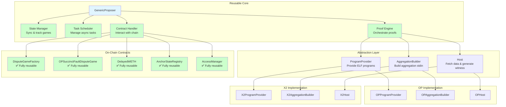

# OP Succinct Framework Architecture

## Architecture Overview



## Component Responsibilities

### Reusable Core (100% Shared)

- **State Manager**: Syncs game state from chain, tracks game tree, manages anchor
- **Task Scheduler**: Creates/manages async tasks, handles task completion
- **Contract Handler**: Creates games, submits proofs, handles challenges
- **Proof Engine**: Coordinates proof generation workflow

### Abstraction Layer (Implement per Project)

- **ProgramProvider**: Provides Range ELF, Aggregation ELF, Verifying Keys
- **AggregationBuilder**: Builds stdin for aggregation proof from range proofs
- **Host**: Fetches blockchain data, generates witness data

### On-Chain Contracts

**Fully Reusable (No Code Changes):**

**Dispute Game Contracts:**
- **DisputeGameFactory**: Factory for creating dispute game instances
- **OPSuccinctFaultDisputeGame**: Custom fault dispute game contract (uses native ETH for bonds)
- **AnchorStateRegistry**: Manages anchor states
- **AccessManager**: Access control for proposers and challengers

**Cross-Chain Bridge Contracts:**
- **L1StandardBridge**: ETH and ERC20 token bridging (L1↔L2)
- **L1ERC721Bridge**: ERC721 NFT bridging (L1↔L2)
- **L2StandardBridge**: L2-side bridge contract (predeployed)

**Supporting Infrastructure (Dependencies):**
- **OptimismPortal2**: Main L1 entry point for L1↔L2 communication
- **SuperchainConfig**: Superchain-wide configuration
- **L1CrossDomainMessenger**: L1-side cross-chain messaging
- **L2CrossDomainMessenger**: L2-side cross-chain messaging (predeployed)

## Proof Flow

```mermaid
flowchart LR
    A[Fetch Data] --> B[Generate Witness]
    B --> C[Get Range ELF]
    C --> D[Prove Range]
    D --> E[Build Aggregation]
    E --> F[Get Aggregation ELF]
    F --> G[Prove Aggregation]
    G --> H[Submit to Chain]
    
    style A fill:#fff4cc
    style B fill:#fff4cc
    style C fill:#fff4cc
    style D fill:#ccffcc
    style E fill:#fff4cc
    style F fill:#fff4cc
    style G fill:#ccffcc
    style H fill:#ccffcc
```



## Code Structure

```
fault-proof/
├── core/              # Reusable (no changes needed)
│   ├── state.rs       # Game state management
│   ├── scheduler.rs   # Task management
│   ├── contract.rs    # Chain interaction
│   └── proof.rs       # Proof orchestration
│
├── traits/            # Implement per project
│   ├── program_provider.rs
│   ├── aggregation_builder.rs
│   └── host.rs
│
└── impl/              # Project-specific
    ├── op/            # OP implementation
    └── x2/            # X2 implementation
```

## What Each Project Needs

### OP Project
- Implement `OPProgramProvider` → returns Kona ELF
- Implement `OPAggregationBuilder` → uses OP-specific logic
- Use existing `OPHost` → already implemented
- **Reuse contracts**: Most OP Stack contracts (DisputeGameFactory, OPSuccinctFaultDisputeGame, etc.) → no changes needed

### X2 Project
- Implement `X2ProgramProvider` → returns X2 ELF
- Implement `X2AggregationBuilder` → X2 aggregation logic
- Implement `X2Host` → X2 data fetching
- **Reuse contracts**: Most OP Stack contracts can be reused, some (like AnchorStateRegistry) may need minor configuration adjustments

## Contract Reusability

OP Stack includes many dispute game related contracts. Here's a breakdown of what can be reused:

### Reusable Contracts (May Need Minor Code Changes)

1. **DisputeGameFactory**
   - **Purpose**: Factory contract for creating and managing dispute game instances
   - **Why**: Generic factory pattern, works with any `IDisputeGame` implementation
   - **Usage**: Both OP and X2 projects use the same factory

2. **OPSuccinctFaultDisputeGame**
   - **Purpose**: Custom fault dispute game contract implementing `IDisputeGame` interface
   - **Why**: Uses standard interfaces (`ISP1Verifier`), proof verification logic is generic
   - **Usage**: Both projects can use the same contract instance
   - **Note**: Uses native ETH for bonds (not DelayedWETH like standard FaultDisputeGame)

3. **AnchorStateRegistry**
   - **Purpose**: Manages anchor states (latest finalized state) for dispute games
   - **Why**: Core logic is generic, initialization parameters can be configured per project
   - **Usage**: Same contract code, initialize with project-specific starting state

4. **AccessManager** (OP Succinct specific)
   - **Purpose**: Access control for proposers and challengers
   - **Why**: Generic access control logic, roles configurable per project
   - **Usage**: Both projects use the same contract

5. **L1StandardBridge**
   - **Purpose**: Handles ETH and ERC20 token bridging between L1 and L2
   - **Why**: Standard OP Stack bridge contract, generic bridging logic
   - **Usage**: Both projects can use for user asset cross-chain transfers

6. **L2StandardBridge**
   - **Purpose**: L2-side bridge contract for ETH and ERC20 tokens
   - **Why**: Standard OP Stack bridge contract, predeployed on L2
   - **Usage**: Both projects use the same L2 bridge

### Supporting Infrastructure Contracts (Dependencies)

7. **OptimismPortal2**
   - **Purpose**: Main L1 entry point, handles L1↔L2 message passing and withdrawals
   - **Why**: Required by AnchorStateRegistry and dispute game system
   - **Usage**: Both projects need this contract

8. **SuperchainConfig**
    - **Purpose**: Superchain-wide configuration (pausing, etc.)
    - **Why**: Required by AnchorStateRegistry and L1CrossDomainMessenger
    - **Usage**: Both projects need this contract

9. **L1CrossDomainMessenger**
    - **Purpose**: L1-side cross-chain message passing interface
    - **Why**: Required by bridge contracts for cross-chain communication
    - **Usage**: Both projects need this contract

10. **L2CrossDomainMessenger**
    - **Purpose**: L2-side cross-chain message passing (predeployed)
    - **Why**: Required by bridge contracts for cross-chain communication
    - **Usage**: Both projects use the same predeployed contract

### Contracts NOT Used by OP Succinct

11. **FaultDisputeGame** (OP Stack standard)
   - **Status**: ❌ Not used
   - **Reason**: OP Succinct uses custom `OPSuccinctFaultDisputeGame` instead

12. **PermissionedDisputeGame** (OP Stack standard)
   - **Status**: ❌ Not used
   - **Reason**: OP Succinct uses `AccessManager` for access control instead

13. **SuperFaultDisputeGame** / **SuperPermissionedDisputeGame**

14. **DelayedWETH** (OP Stack standard)
   - **Status**: ❌ Not used by OPSuccinctFaultDisputeGame
   - **Reason**: OPSuccinctFaultDisputeGame uses native ETH for bonds instead
   - **Status**: ❌ Not used
   - **Reason**: These are for Superchain interop, not needed for OP Succinct

### Summary

**Fully Reusable (10 contracts, no code changes):**

**Dispute Game (4):**
- `DisputeGameFactory`, `OPSuccinctFaultDisputeGame`, `AnchorStateRegistry`, `AccessManager`

**Cross-Chain Bridges (2):**
- `L1StandardBridge`, `L2StandardBridge`

**Infrastructure (4):**
- `OptimismPortal2`, `SuperchainConfig`, `L1CrossDomainMessenger`, `L2CrossDomainMessenger`

**Why contracts are reusable:**
- Contracts interact through standard interfaces (`IDisputeGame`, `ISP1Verifier`, `IAnchorStateRegistry`)
- Game logic is generic and doesn't depend on specific program implementation
- Only the proof content differs (different ELF programs), but verification interface is the same
- All contracts can be reused without code changes, only configuration differs per project

## Summary

- **4 core modules**: Fully reusable, no changes needed
- **10 OP Stack contracts**: All fully reusable (no code changes)
  - Dispute game: `DisputeGameFactory`, `OPSuccinctFaultDisputeGame`, `AnchorStateRegistry`, `AccessManager`
  - Cross-chain bridges: `L1StandardBridge`, `L2StandardBridge`
  - Infrastructure: `OptimismPortal2`, `SuperchainConfig`, `L1CrossDomainMessenger`, `L2CrossDomainMessenger`
- **3 traits**: Implement once per project
- **Clear separation**: Reusable vs project-specific code
