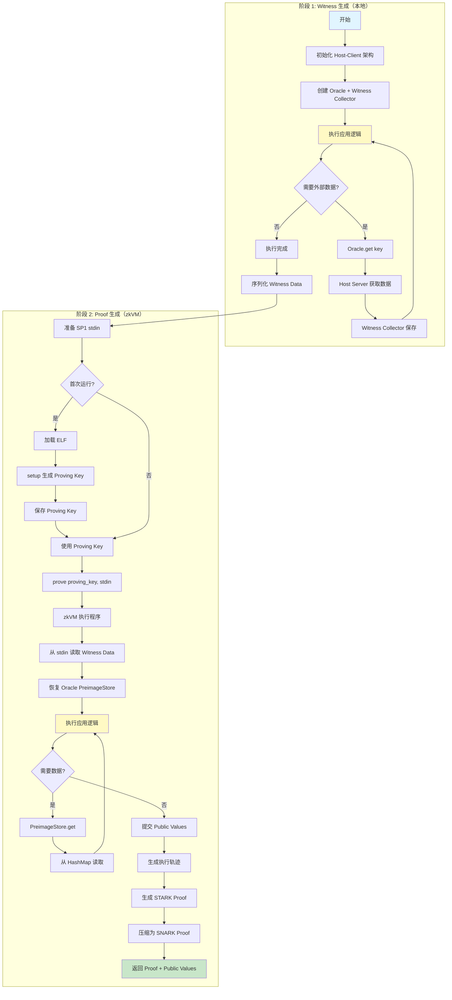
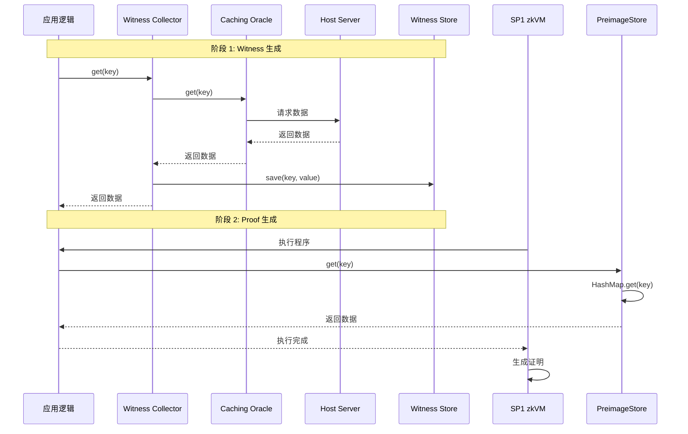

# 通用 zkVM 证明生成流程

## 目录

1. [概述](#概述)
2. [核心流程](#核心流程)
3. [详细步骤](#详细步骤)
4. [关键概念](#关键概念)
5. [流程图](#流程图)

---

## 概述

本文档描述了一个通用的零知识证明生成流程，适用于任何需要证明计算正确性的应用。核心思想是：

1. **第一次执行（Witness 生成）**：在本地模拟执行，收集所有外部数据访问
2. **第二次执行（Proof 生成）**：在 zkVM 中使用预收集的数据，生成零知识证明

这种两阶段设计确保了：
- ✅ **确定性**：zkVM 执行完全确定性，不依赖外部数据
- ✅ **可验证性**：验证者可以验证证明的正确性
- ✅ **代码复用**：相同的执行逻辑在两种环境下运行

---

## 核心流程

### 流程概览

```
┌─────────────────────────────────────────────────────────────┐
│                    通用 zkVM 证明生成流程                      │
└─────────────────────────────────────────────────────────────┘

阶段 1: Witness 生成（本地执行）
├─ 1.1 初始化 Host-Client 架构
├─ 1.2 执行应用逻辑（模拟执行）
├─ 1.3 收集所有外部数据访问 → Witness Data
└─ 1.4 序列化 Witness Data

阶段 2: Proof 生成（zkVM 执行）
├─ 2.1 准备 SP1 输入（stdin）
├─ 2.2 加载 ELF 或使用 Proving Key
├─ 2.3 在 zkVM 中执行程序
├─ 2.4 生成零知识证明
└─ 2.5 返回 Proof + Public Values
```

---

## 详细步骤

### 阶段 1: Witness 生成（本地执行）

#### 步骤 1.1: 初始化 Host-Client 架构

**目的**: 建立数据获取机制，让执行逻辑可以通过 Oracle 获取外部数据。

**架构组件**:

```
┌─────────────┐         ┌──────────────┐         ┌─────────────┐
│   Client    │◄───────►│   Channel    │◄───────►│ Host Server │
│ (Executor)  │         │  (IPC/网络)   │         │  (Oracle)   │
└─────────────┘         └──────────────┘         └─────────────┘
     │                                              │
     │ 请求数据 (key)                               │ 获取数据
     │                                              │ (RPC/DB/API)
     └──────────────────────────────────────────────┘
```

**关键组件**:

1. **Host Server**:
   - 作为数据源（Oracle）
   - 接收数据请求（通过 channel）
   - 从外部系统获取数据（RPC、数据库、API 等）
   - 返回数据给 Client

2. **Client (Executor)**:
   - 执行应用逻辑
   - 通过 Oracle 接口请求数据
   - 收集所有数据访问到 Witness Store

3. **Witness Collector**:
   - 拦截所有 Oracle 请求
   - 保存 key-value 对到 Witness Store
   - 用于后续 zkVM 执行

**初始化代码结构**:

```rust
// 1. 创建通信通道
let preimage_channel = BidirectionalChannel::new()?;  // 数据通道
let hint_channel = BidirectionalChannel::new()?;      // Hint 通道

// 2. 启动 Host Server（后台进程）
let server_task = start_host_server(
    hint_channel.host_side,
    preimage_channel.host_side
).await?;

// 3. 创建 Oracle（带 Witness 收集）
let oracle = PreimageWitnessCollector::new(
    CachingOracle::new(
        OracleReader::new(preimage_channel.client_side),
        HintWriter::new(hint_channel.client_side),
    ),
    witness_store.clone(),  // ⭐ 收集所有数据访问
);

// 4. 创建 Executor（使用 Oracle）
let executor = YourExecutor::new(oracle);
```

#### 步骤 1.2: 执行应用逻辑（模拟执行）

**目的**: 运行应用的核心逻辑，触发所有需要的数据访问。

**执行流程**:

```rust
// 伪代码示例
async fn execute_application_logic(executor: Executor) -> Result<Output> {
    // 应用逻辑：需要访问外部数据
    let input_data = executor.get_data(key1)?;  // ⭐ 触发 Oracle 请求
    let result = process(input_data)?;
    let more_data = executor.get_data(key2)?;  // ⭐ 触发 Oracle 请求
    let final_result = combine(result, more_data)?;
    
    // 提交 public values（如果需要）
    executor.commit_public_value(final_result)?;
    
    Ok(final_result)
}
```

**关键点**:
- 执行逻辑与正常应用逻辑相同
- 所有外部数据访问都通过 Oracle 接口
- Oracle 会自动收集所有访问的数据

#### 步骤 1.3: 收集 Witness Data

**Witness Data 结构**:

```rust
pub struct WitnessData {
    // 所有外部数据访问的 key-value 对
    pub preimage_store: PreimageStore,  // HashMap<PreimageKey, Vec<u8>>
    
    // 其他需要的数据（可选）
    pub blob_data: BlobData,             // 例如：EIP-4844 blob 数据
    pub custom_data: CustomData,         // 应用特定的数据
}
```

**Witness Data 包含**:

1. **Preimage Store**:
   - 所有通过 Oracle 获取的数据
   - Key: 数据的哈希（PreimageKey）
   - Value: 实际数据（Vec<u8>）
   - 示例：
     - 数据库查询结果
     - API 响应
     - 文件内容
     - 链上数据（区块、交易、状态）

2. **Blob Data**（可选）:
   - 大文件或二进制数据
   - 例如：EIP-4844 blob、图像、视频等

3. **Custom Data**（可选）:
   - 应用特定的数据
   - 例如：配置、元数据等

**收集机制**:

```rust
// PreimageWitnessCollector 自动收集
impl PreimageOracleClient for PreimageWitnessCollector {
    async fn get(&self, key: PreimageKey) -> Result<Vec<u8>> {
        // 1. 从底层 Oracle 获取数据
        let value = self.oracle.get(key).await?;
        
        // 2. ⭐ 自动保存到 Witness Store
        self.witness_store.save(key, value.clone());
        
        // 3. 返回数据
        Ok(value)
    }
}
```

#### 步骤 1.4: 序列化 Witness Data

**目的**: 将 Witness Data 转换为可以传递给 zkVM 的格式。

```rust
fn serialize_witness(witness: WitnessData) -> Vec<u8> {
    // 使用 rkyv 或其他序列化库
    rkyv::to_bytes(&witness).unwrap()
}
```

**序列化要求**:
- 必须支持反序列化（在 zkVM 中）
- 格式稳定（相同数据总是产生相同字节）
- 高效（压缩、快速）

---

### 阶段 2: Proof 生成（zkVM 执行）

#### 步骤 2.1: 准备 SP1 输入（stdin）

**目的**: 将 Witness Data 包装成 SP1 程序的输入。

```rust
fn prepare_sp1_stdin(witness_data: WitnessData) -> SP1Stdin {
    let mut stdin = SP1Stdin::new();
    
    // 序列化 witness data
    let witness_bytes = serialize_witness(witness_data);
    
    // 写入 stdin
    stdin.write_slice(&witness_bytes);
    
    stdin
}
```

**SP1Stdin 结构**:
- SP1 程序的输入流
- 支持多种数据类型（Vec<u8>, Proof, VerifyingKey 等）
- 程序通过 `sp1_zkvm::io::read_vec()` 读取

#### 步骤 2.2: 加载 ELF 或使用 Proving Key

**两种方式**:

**方式 1: 使用 ELF（首次运行）**

```rust
// 1. 编译程序为 ELF
// cargo-prove prove build --elf-name your-program

// 2. 加载 ELF
let elf = include_bytes!("path/to/your-program.elf");

// 3. 生成 Proving Key（一次性）
let (proving_key, verifying_key) = prover.setup(elf)?;
```

**方式 2: 使用 Proving Key（后续运行）**

```rust
// 直接使用预生成的 Proving Key
let proving_key = load_proving_key("path/to/proving_key.bin");
```

**Proving Key 包含**:
- 程序电路的结构化参数
- 可信设置参数（SRS）
- 加密材料
- 程序元数据

**为什么不需要 ELF**:
- Proving Key 已经包含了程序的所有信息
- 在初始化时通过 `setup(ELF)` 生成
- 后续只需使用 Proving Key 即可

#### 步骤 2.3: 在 zkVM 中执行程序

**程序入口**:

```rust
// your-program/src/main.rs
fn main() {
    // 1. 从 stdin 读取 witness data
    let witness_bytes: Vec<u8> = sp1_zkvm::io::read_vec();
    let witness_data = deserialize_witness(witness_bytes)?;
    
    // 2. 恢复 Oracle（从 Witness Data）
    let oracle = witness_data.get_oracle()?;  // PreimageStore
    
    // 3. 执行应用逻辑（与第一次执行相同！）
    let result = execute_application_logic(oracle)?;
    
    // 4. 提交 public values
    sp1_zkvm::io::commit(&result);
}
```

**关键点**:
- 程序逻辑与第一次执行**完全相同**
- Oracle 从 Witness Data 恢复（PreimageStore）
- 数据直接从 HashMap 读取，不通过 channel

**Oracle 恢复**:

```rust
impl WitnessData {
    fn get_oracle(self) -> Result<PreimageStore> {
        // PreimageStore 实现了 PreimageOracleClient trait
        // 可以直接作为 Oracle 使用
        Ok(self.preimage_store)
    }
}

impl PreimageOracleClient for PreimageStore {
    async fn get(&self, key: PreimageKey) -> Result<Vec<u8>> {
        // ⭐ 直接从 HashMap 读取，不通过 channel
        self.preimage_map.get(&key).cloned()
            .ok_or(PreimageOracleError::InvalidPreimageKey)
    }
}
```

#### 步骤 2.4: 生成零知识证明

**证明生成流程**:

```
程序执行
  ↓
生成执行轨迹（Execution Trace）
  ↓
转换为算术电路（Arithmetic Circuit）
  ↓
生成 STARK Proof（使用 FRI）
  ↓
压缩为 SNARK Proof（可选，用于链上验证）
  ↓
返回 Proof + Public Values
```

**代码调用**:

```rust
let proof = prover
    .prove(&proving_key, &stdin)  // ⭐ 使用 Proving Key 和 stdin
    .compressed()                  // 使用 Compressed 模式（STARK + SNARK）
    .run_async()
    .await?;
```

**证明模式**:

1. **Compressed 模式**（推荐）:
   - 内部使用 STARK（FRI proof）
   - 然后压缩为 SNARK
   - 平衡证明大小和验证速度

2. **Plonk/Groth16 模式**:
   - 直接生成 SNARK proof
   - 用于链上验证
   - 证明小，验证快

#### 步骤 2.5: 返回 Proof + Public Values

**返回结构**:

```rust
pub struct ProofWithPublicValues {
    pub proof: SP1Proof,           // 零知识证明
    pub public_values: PublicValues, // Public values（通过 commit() 提交的）
}
```

**Public Values**:
- 只有通过 `sp1_zkvm::io::commit()` 提交的数据才会成为 public values
- 验证者可以看到这些值
- 用于验证证明的正确性

---

## 关键概念

### 1. Oracle 抽象

**设计模式**: 使用 trait 抽象 Oracle，支持不同的实现。

```rust
trait PreimageOracleClient {
    async fn get(&self, key: PreimageKey) -> Result<Vec<u8>>;
}

// 第一次执行：CachingOracle（通过 channel）
impl PreimageOracleClient for CachingOracle { ... }

// 第二次执行：PreimageStore（从 HashMap）
impl PreimageOracleClient for PreimageStore { ... }
```

**优势**:
- 代码复用：相同的执行逻辑
- 灵活性：可以切换不同的数据源
- 可测试性：可以 mock Oracle

### 2. Witness Data

**定义**: 所有外部数据访问的记录。

**包含**:
- 所有通过 Oracle 获取的数据（key-value 对）
- 数据的哈希验证（确保数据正确性）
- 其他必要的元数据

**用途**:
- 在 zkVM 中提供数据（替代外部数据源）
- 确保证明的确定性
- 允许验证者验证数据正确性

### 3. Public Values

**定义**: 证明中公开可见的值。

**特点**:
- 通过 `sp1_zkvm::io::commit()` 明确提交
- 验证者可以看到
- 用于验证证明的正确性

**示例**:
- 计算的最终结果
- 状态转换的起始和结束状态
- 关键元数据

### 4. Proving Key vs ELF

| 方面 | ELF | Proving Key |
|------|-----|-------------|
| **用途** | 程序执行 | 证明生成 |
| **生成** | 编译 Rust 代码 | `setup(ELF)` |
| **大小** | 较大（完整程序） | 较大（电路参数） |
| **使用** | 首次运行或 setup | 后续证明生成 |
| **包含** | RISC-V 指令 | 电路参数、SRS |

**关系**:
```
ELF → setup() → Proving Key + Verifying Key
```

---

## 流程图

### 完整流程图



### 数据流图



---

## 实施检查清单

### 阶段 1: Witness 生成

- [ ] 定义应用的数据访问接口（Oracle trait）
- [ ] 实现 Host Server（数据源）
- [ ] 实现 Witness Collector（拦截数据访问）
- [ ] 实现应用执行逻辑
- [ ] 确保所有外部数据访问都通过 Oracle
- [ ] 定义 Witness Data 结构
- [ ] 实现 Witness Data 序列化

### 阶段 2: Proof 生成

- [ ] 编写 zkVM 程序（main.rs）
- [ ] 实现 Witness Data 反序列化
- [ ] 实现 PreimageStore（从 Witness Data 恢复 Oracle）
- [ ] 确保程序逻辑与第一次执行相同
- [ ] 定义 Public Values 结构
- [ ] 在程序中提交 Public Values
- [ ] 编译程序为 ELF
- [ ] 生成 Proving Key（首次运行）
- [ ] 实现证明生成调用

### 通用要求

- [ ] Oracle 接口设计（trait）
- [ ] 错误处理
- [ ] 日志和调试
- [ ] 测试（单元测试、集成测试）

---

## 总结

通用 zkVM 证明生成流程的核心是：

1. **两阶段执行**：
   - 第一次：本地执行，收集 witness
   - 第二次：zkVM 执行，生成证明

2. **Oracle 抽象**：
   - 使用 trait 抽象数据访问
   - 第一次：通过 channel 获取数据
   - 第二次：从 HashMap 读取数据

3. **Witness Data**：
   - 包含所有外部数据访问
   - 序列化后传递给 zkVM
   - 在 zkVM 中恢复为 Oracle

4. **Public Values**：
   - 通过 `commit()` 明确提交
   - 用于验证证明的正确性

5. **Proving Key**：
   - 从 ELF 通过 `setup()` 生成
   - 后续证明生成只需 Proving Key

这种设计确保了：
- ✅ 代码复用（相同的执行逻辑）
- ✅ 确定性执行（预收集的数据）
- ✅ 可验证性（Public Values + Proof）
- ✅ 灵活性（适用于任何应用）

