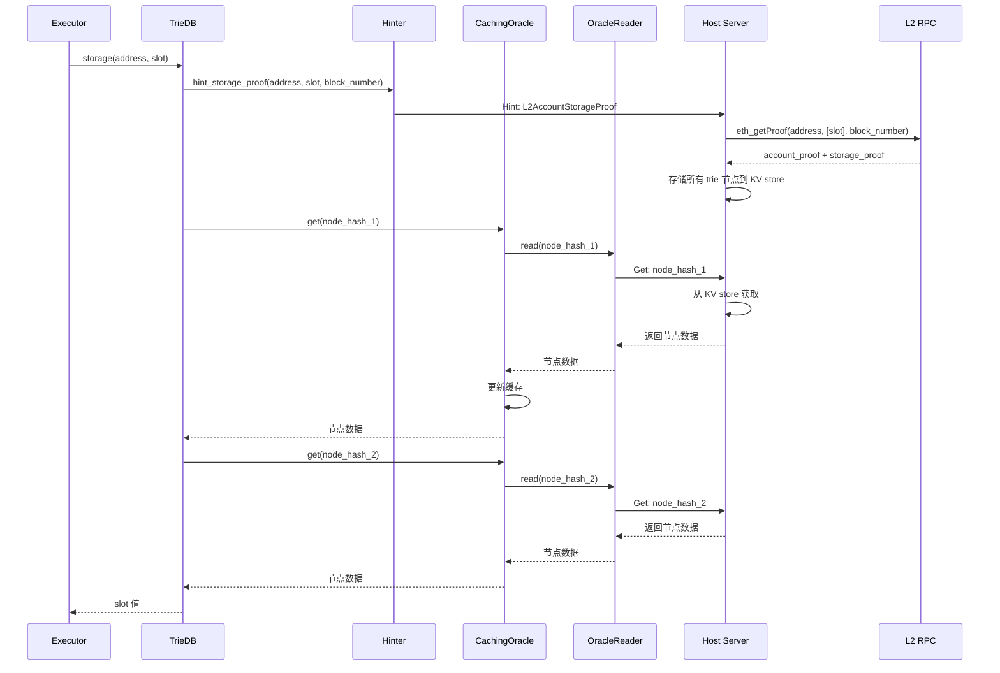
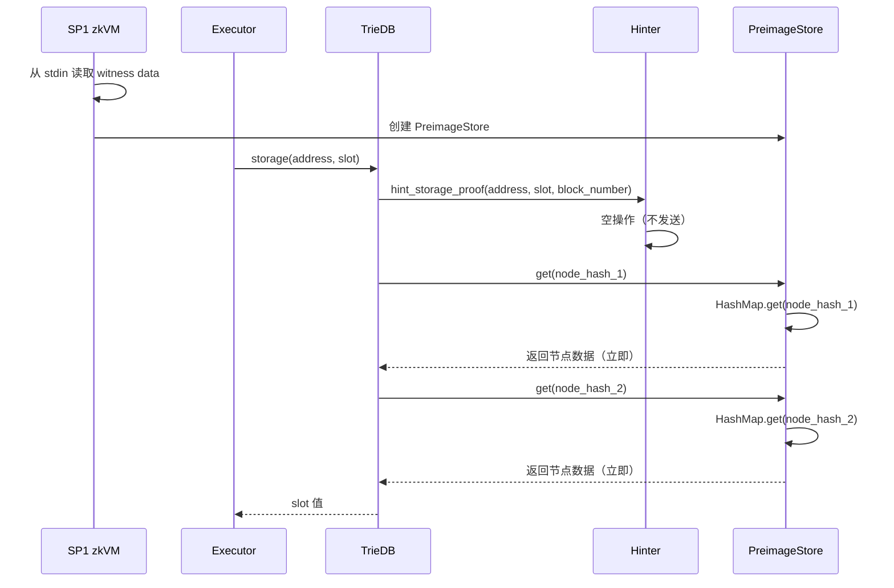

# Oracle 与 Hint-Get 机制技术文档

## 目录

1. [概述](#概述)
2. [两个阶段的核心区别](#两个阶段的核心区别)
3. [Oracle 的设计：Hint-Get 机制](#oracle-的设计hint-get-机制)
4. [Hint 类型和示例](#hint-类型和示例)
5. [Witness 收集阶段详解](#witness-收集阶段详解)
6. [zkVM 执行阶段详解](#zkvm-执行阶段详解)
7. [完整流程对比](#完整流程对比)
8. [关键设计原理](#关键设计原理)

---

## 概述

### zkVM 证明生成的两阶段架构

在零知识虚拟机（zkVM）的证明生成流程中，程序逻辑需要执行两次：

1. **Witness 收集阶段**：首次执行程序，收集执行过程中访问的所有外部数据
2. **zkVM 执行阶段**：在 zkVM 中重新执行相同程序，生成零知识证明

**核心设计**：两次执行使用**完全相同的代码和逻辑**，区别仅在于数据访问方式的不同。

### 两阶段设计的必要性

zkVM 执行必须满足**完全确定性**要求：
- 相同的输入必须产生相同的输出
- 不能依赖外部服务的响应时间或可用性
- 不能存在任何随机性或不确定性

**解决方案**：通过两阶段执行实现确定性与灵活性的平衡：
- **第一阶段（Witness 收集）**：允许动态访问外部数据，同时记录所有数据访问
- **第二阶段（zkVM 执行）**：使用已收集的数据，确保执行完全确定

### Oracle：两阶段的核心差异

两阶段的核心差异在于 **Oracle（数据访问抽象层）** 的实现：

| 阶段 | Oracle 实现 | 数据来源 | 特点 |
|------|------------|---------|------|
| **Witness 收集** | `CachingOracle` + `PreimageWitnessCollector` | RPC → 链上数据 | 动态获取，自动收集 |
| **zkVM 执行** | `PreimageStore` | HashMap → 已收集数据 | 静态访问，完全确定 |

这种设计实现了：
- **确定性保证**：zkVM 执行不依赖外部服务
- **可重现性**：相同 Witness Data 产生相同结果
- **性能优化**：Witness 收集阶段可使用缓存和预取机制

---

## 两个阶段的核心区别

两阶段的核心区别在于 Oracle 的实现方式，具体对比如下：

| 方面 | Witness 收集阶段 | zkVM 执行阶段 |
|------|----------------|-------------|
| **Oracle 类型** | `CachingOracle` + `PreimageWitnessCollector` | `PreimageStore` |
| **数据来源** | Host Server → RPC → 链上数据 | PreimageStore → HashMap |
| **Hint 行为** | 发送到 Host Server，触发 RPC | 空操作（数据已存在） |
| **Get 行为** | 通过 Channel 请求，可能触发 RPC | 直接从 HashMap 读取 |
| **数据收集** | 自动保存所有访问的数据 | 不收集（使用已有数据） |
| **外部依赖** | 需要 RPC 连接 | 完全自包含 |
| **确定性** | 依赖 RPC 响应 | 完全确定 |

---

## Oracle 的设计：Hint-Get 机制

### Oracle 的核心接口

Oracle 提供两个核心接口来管理外部数据访问：

```rust
// Hint 接口：发送提示，告知需要哪些数据
trait HintWriterClient {
    async fn write(&self, hint: &str) -> PreimageOracleResult<()>;
}

// Get 接口：获取数据，通过 preimage key 获取具体数据
trait PreimageOracleClient {
    async fn get(&self, key: PreimageKey) -> PreimageOracleResult<Vec<u8>>;
}
```

### 设计模式：先 Hint 再 Get

**标准流程**：

```
1. Client 发送 Hint（提前告知需要的数据）
   ↓
2. Host Server 处理 Hint（RPC 调用，存储数据到 KV store）
   ↓
3. Client 调用 Get（通过 preimage key）
   ↓
4. Host Server 返回数据（从 KV store）
```

**关键点**：
- **Hint 是异步的**：发送后立即返回，不等待数据获取
- **Get 是同步的**：必须等待数据返回
- **Hint 可以批量发送**：提前告知多个数据需求
- **Get 按需调用**：只在真正需要数据时调用

### Oracle 在两个阶段的实现

#### Witness 收集阶段：动态 Oracle

**架构**：

```rust
PreimageWitnessCollector {
    preimage_oracle: CachingOracle {
        cache: HashMap,              // 本地缓存
        reader: OracleReader,        // 通过 NativeChannel 与 Host Server 通信
        writer: HintWriter,          // 通过 NativeChannel 发送 hint
    },
    preimage_witness_store: PreimageStore,  // 自动收集所有数据
}
```

**Hint 行为**：真正发送 hint 到 Host Server，触发 RPC 调用

**Get 行为**：从底层 oracle 获取数据，并自动保存到 witness store

**数据流**：
```
Hint → HintWriter → NativeChannel → Host Server → RPC → 链上数据
Get  → OracleReader → NativeChannel → Host Server → KV Store → 返回数据
```

#### zkVM 执行阶段：静态 Oracle

**架构**：

```rust
PreimageStore {
    preimage_map: HashMap<PreimageKey, Vec<u8>>,  // 所有数据已存在
}
```

**Hint 行为**：空操作（数据已存在，无需发送 hint）

**Get 行为**：直接从 HashMap 读取，无需 RPC 或 Channel

**数据流**：
```
Hint → PreimageStore.write() → Ok(())  // 空操作
Get  → PreimageStore.get() → HashMap.get() → 直接返回
```

### Oracle 创建方式

**Witness 收集阶段**：
```rust
let preimage_oracle = Arc::new(CachingOracle::new(
    2048,
    OracleReader::new(preimage_chan),
    HintWriter::new(hint_chan),
));
let oracle = Arc::new(PreimageWitnessCollector {
    preimage_oracle: preimage_oracle.clone(),
    preimage_witness_store: preimage_witness_store.clone(),
});
```

**zkVM 执行阶段**：
```rust
let (oracle, beacon) = witness_data
    .get_oracle_and_blob_provider()
    .await?;
// oracle 是 PreimageStore
```

---

## Hint 类型和示例

### 1. Block Hint（区块 Hint）

#### L2BlockHeader Hint

**发送时机**：需要读取 L2 区块头时

**使用方式**：
1. 发送 hint：`HintType::L2BlockHeader.with_data(&[hash]).send()`
2. 获取数据：`oracle.get(PreimageKey::new_keccak256(hash))`

**数据格式**：`[32 bytes 区块哈希] + [8 bytes Chain ID（可选）]`

**Host Server 处理**：RPC 调用 `debug_get_raw_header`，存储区块头到 KV store

#### L2Transactions Hint

**发送时机**：需要读取 L2 区块的交易列表时

**使用方式**：发送 hint 后，通过 trie walker 遍历交易 trie，每个节点通过 `get()` 获取

**数据格式**：`[32 bytes 区块哈希] + [8 bytes Chain ID（可选）]`

**Host Server 处理**：RPC 调用获取区块，存储交易 trie 的所有节点到 KV store

### 2. Account Hint（账户 Hint）

#### L2AccountProof Hint

**发送时机**：需要读取账户信息时（balance、nonce、code_hash）

**使用方式**：发送 hint 后，遍历 state trie 获取账户节点，每个节点通过 `get()` 获取

**数据格式**：`[8 bytes 区块号] + [20 bytes 账户地址] + [8 bytes Chain ID（可选）]`

**Host Server 处理**：RPC 调用 `eth_getProof(address, [])`，存储 account_proof 的所有 trie 节点

**使用场景**：执行交易时需要访问账户状态（如检查 balance、nonce）

### 3. Storage Hint（存储 Hint）

#### L2AccountStorageProof Hint

**发送时机**：需要读取或修改 storage slot 时

**使用方式**：发送 hint 后，遍历 storage trie 获取 slot 值，每个节点通过 `get()` 获取

**数据格式**：`[8 bytes 区块号] + [20 bytes 账户地址] + [32 bytes Storage slot] + [8 bytes Chain ID（可选）]`

**Host Server 处理**：RPC 调用 `eth_getProof(address, [slot], block_number)`，存储 account_proof 和 storage_proof 的所有 trie 节点

**使用场景**：
- 执行 ERC20 转账时需要读取 balance
- EIP-2935 历史区块哈希查找

### 4. 其他 Hint 类型

#### L2Code Hint

**发送时机**：需要读取合约代码时

**使用方式**：发送 hint 后，通过 `oracle.get(code_hash)` 获取代码

#### L2StateNode Hint

**发送时机**：需要读取状态 trie 节点时

**使用方式**：发送 hint 后，通过 `oracle.get(node_hash)` 获取节点

---

## Witness 收集阶段详解

### 架构概览

```
┌─────────────────────────────────────────────────────────┐
│                    Witness 收集阶段                       │
├─────────────────────────────────────────────────────────┤
│                                                           │
│  Client (Witness Executor)          Host Server          │
│  ────────────────────────          ───────────          │
│                                                           │
│  1. hint_account_proof()  ──────→  fetch_hint()         │
│                                      ↓                    │
│  2. oracle.get(key)       ←──────  RPC: eth_getProof()  │
│     ↓                                ↓                    │
│  3. PreimageWitnessCollector       KV Store              │
│     ↓                                ↓                    │
│  4. CachingOracle                  存储所有 trie 节点     │
│     ↓                                                    │
│  5. OracleReader                                         │
│     ↓                                                    │
│  6. NativeChannel (双向通道)                            │
│                                                           │
└─────────────────────────────────────────────────────────┘
```

### 组件说明

#### 1. PreimageWitnessCollector

**作用**：包装底层 oracle，自动收集所有 preimage 请求

**关键点**：
- 所有 `get()` 调用都会被记录并自动保存到 `PreimageStore`
- 收集过程对执行逻辑透明，不影响执行

#### 2. CachingOracle

**作用**：提供缓存层，减少重复的 RPC 调用

**工作方式**：先检查缓存，未命中则通过 `OracleReader` 从 Host Server 获取，并更新缓存

#### 3. OracleReader 和 HintWriter

**作用**：通过 `NativeChannel` 与 Host Server 通信

**工作方式**：
- `OracleReader`：通过 channel 发送 key，等待返回 value
- `HintWriter`：通过 channel 发送 hint

### 执行流程

**典型流程**（以读取账户信息为例）：
1. 发送 hint：`hint_account_proof()` → Host Server → RPC 调用 → 存储 trie 节点到 KV store
2. 获取数据：`oracle.get(node_hash)` → 检查缓存 → 未命中则通过 Channel 请求 → 自动保存到 witness store
3. 解码数据：从 trie 节点解码账户信息

### Witness Data 结构

```rust
// utils/client/src/witness/mod.rs:44-48
pub struct DefaultWitnessData {
    pub preimage_store: PreimageStore,  // 所有 preimage 请求和响应
    pub blob_data: BlobData,             // EIP-4844 blob 数据
}

pub struct PreimageStore {
    // HashMap<PreimageKey, Vec<u8>>
    // 存储所有通过 oracle 获取的数据
    // Key: preimage key (hash)
    // Value: preimage value (实际数据)
    preimage_map: HashMap<PreimageKey, Vec<u8>>,
}
```

**收集的数据包括**：
- L1 区块头、交易、收据
- L2 区块头、交易、收据
- 账户 proof 的所有 trie 节点
- Storage proof 的所有 trie 节点
- 合约代码
- Blob 数据

---

## zkVM 执行阶段详解

### 架构概览

```
┌─────────────────────────────────────────────────────────┐
│                    ELF 执行阶段（zkVM）                    │
├─────────────────────────────────────────────────────────┤
│                                                           │
│  SP1 zkVM                  PreimageStore                 │
│  ──────────                ─────────────                │
│                                                           │
│  1. 从 stdin 读取 witness data                           │
│     ↓                                                     │
│  2. 反序列化为 PreimageStore                             │
│     ↓                                                     │
│  3. 执行相同的状态转换逻辑                                │
│     ↓                                                     │
│  4. oracle.get(key)  ─────→  PreimageStore.get()         │
│                              ↓                           │
│  5. 直接从 HashMap 读取      HashMap.get(key)            │
│                              ↓                           │
│  6. 返回数据               直接返回，无需 RPC             │
│                                                           │
└─────────────────────────────────────────────────────────┘
```

### 关键区别

| 方面 | Witness 收集阶段 | ELF 执行阶段 |
|------|----------------|-------------|
| **Oracle 类型** | `CachingOracle` | `PreimageStore` |
| **数据来源** | Host Server → RPC | PreimageStore → HashMap |
| **Hint 处理** | 发送到 Host Server | 不发送（数据已存在） |
| **Get 处理** | 通过 Channel 请求 | 直接从 HashMap 读取 |
| **外部依赖** | 需要 RPC 连接 | 完全自包含 |
| **确定性** | 依赖 RPC 响应 | 完全确定 |

### 程序入口

程序从 stdin 读取 witness data，反序列化为 `PreimageStore`，然后执行相同的状态转换逻辑。

**关键点**：`oracle` 是 `PreimageStore`，不是 `CachingOracle`。

### PreimageStore 实现

`PreimageStore` 实现了 `PreimageOracleClient` trait，`get()` 方法直接从 `HashMap` 读取，不通过 channel。

### 执行流程

**典型流程**（以读取账户信息为例）：
1. 从 stdin 读取 witness data，恢复 `PreimageStore`
2. 执行相同的状态转换逻辑
3. Hint 调用：`PreimageStore.write()` 是空操作，直接返回
4. Get 调用：直接从 `HashMap` 读取，立即返回
5. 解码数据：从 trie 节点解码账户信息

### Hint 在 zkVM 执行阶段的处理

**关键点**：
- 数据已存在：所有需要的数据都在 `PreimageStore` 中
- Hint 是空操作：`PreimageStore.write()` 直接返回 `Ok(())`，不发送到 Host Server
- 代码逻辑保持不变：仍然可以调用 hint 方法，但不会真正发送

---

## 完整流程对比

### 场景：读取账户 Storage Slot

#### Witness 收集阶段流程



#### zkVM 执行阶段流程



### 数据流对比

| 步骤 | Witness 收集阶段 | ELF 执行阶段 |
|------|----------------|-------------|
| **1. Hint** | 发送到 Host Server | 空操作（不发送） |
| **2. Host 处理** | RPC 调用，存储数据 | 无（数据已存在） |
| **3. Get** | 通过 Channel 请求 | 直接从 HashMap 读取 |
| **4. 数据返回** | 从 KV store 返回 | 从 HashMap 返回 |
| **5. 延迟** | 网络延迟 + RPC 延迟 | 无延迟（内存访问） |
| **6. 确定性** | 依赖 RPC 响应 | 完全确定 |

---

## 关键设计原理

### 1. Hint-Get 机制的优势

- **预取优化**：Hint 提前告知 Host Server 需要的数据，Host Server 可以批量获取，减少执行延迟
- **批量处理**：一个 hint 可以获取多个 preimage（如 account_proof 包含多个 trie 节点），减少 RPC 调用次数

### 2. 两阶段设计的必要性

- **确定性要求**：zkVM 执行必须完全确定，不能依赖外部服务的响应时间
- **可重现性**：相同的 witness data 总是产生相同的执行结果，便于调试和验证

### 3. PreimageStore 的设计

- **自包含**：所有数据都在 PreimageStore 中，无需外部访问
- **高效访问**：HashMap 查找是 O(1)，无网络延迟，内存访问速度快

### 4. Hint 在 zkVM 执行阶段的处理

PreimageStore 实现了 `HintWriterClient` trait，但 `write()` 方法是空操作。这样代码逻辑保持不变（仍然可以调用 hint 方法），但不会真正发送 hint 到 Host Server。

