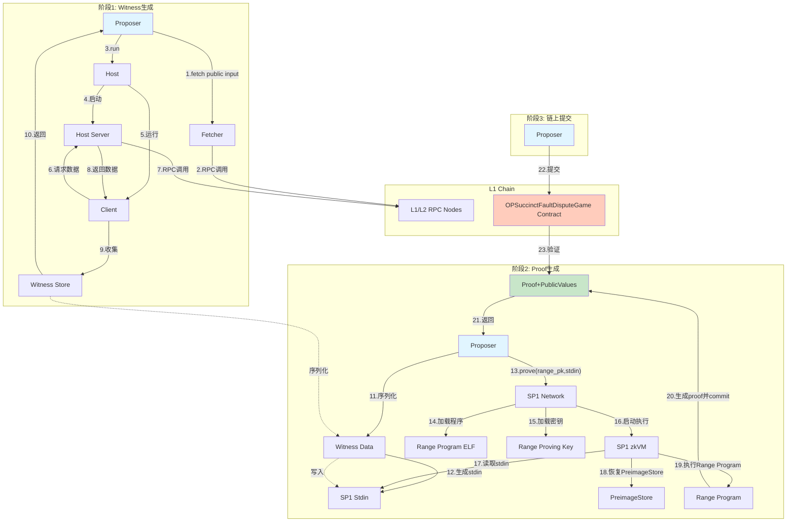
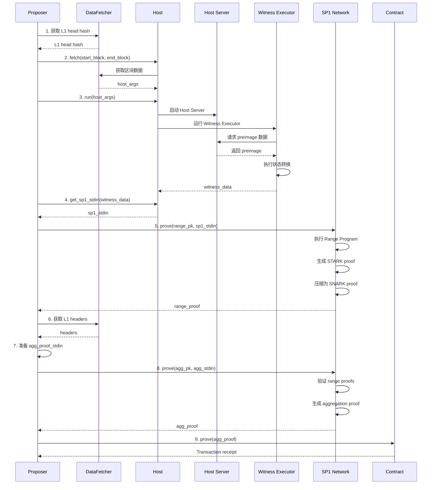

# prove_game 技术文档

## 目录

1. [概述](#概述)
2. [系统架构](#系统架构)
3. [完整流程](#完整流程)
4. [关键步骤详解](#关键步骤详解)
5. [数据结构](#数据结构)
6. [证明生成原理](#证明生成原理)
7. [程序编译](#程序编译)

---

## 概述

`prove_game` 是 OP Succinct Fault Proof 系统的核心函数，负责为指定的区块范围生成零知识证明，并提交到链上。整个过程包括：

1. **Witness 生成**：执行状态转换并收集见证数据
2. **Range Proof 生成**：为区块范围生成状态转换证明
3. **Aggregation Proof 生成**：聚合多个 range proof
4. **链上提交**：将最终证明提交到 L1 合约

---

## 系统架构

### 架构图

#### 数据流图



### 组件说明

- **Proposer**: 主协调器，管理整个证明流程
- **OPSuccinctDataFetcher**: 从 L1/L2 链获取数据
- **OPSuccinctHost**: 管理 Host-Client 架构
- **SP1Prover**: SP1 证明生成器，包含 proving keys
- **Kona Host Server**: 提供 preimage oracle 服务
- **Witness Executor**: 执行状态转换并收集 witness
- **SP1 zkVM**: 执行零知识证明程序

---

## 完整流程

### 流程图



---

## 关键步骤详解

### 步骤 1: 初始化数据获取器

```rust
let fetcher = OPSuccinctDataFetcher::new_with_rollup_config().await?;
```

**功能**: 创建数据获取器，用于从 L1/L2 链获取区块数据、状态证明等。

**关键配置**:
- Rollup 配置（链 ID、合约地址等）
- RPC 端点配置
- 数据缓存策略

### 步骤 2: 获取 L1 Head Hash

```rust
let game = OPSuccinctFaultDisputeGame::new(game_address, self.l1_provider.clone());
let l1_head_hash = game.l1Head().call().await?.0;
```

**功能**: 从链上合约获取游戏的 L1 head hash，用于锚定证明的 L1 状态。

**作用**: 
- 确保证明基于正确的 L1 状态
- 防止重放攻击
- 建立 L1-L2 状态关联

### 步骤 3: 获取 Host 参数

```rust
let host_args = self
    .host
    .fetch(start_block, end_block, Some(l1_head_hash.into()), self.config.safe_db_fallback)
    .await?;
```

**功能**: 准备 Host Server 启动所需的参数。

**参数说明**:
- `start_block`: L2 起始区块号
- `end_block`: L2 结束区块号
- `l1_head_hash`: L1 锚定区块哈希
- `safe_db_fallback`: 是否使用安全数据库回退

**返回内容** (`host_args`):
- L2 区块数据（起始和结束区块的状态）
- L1 区块信息
- 状态证明（Merkle proofs）

### 步骤 4: 生成 Witness Data

```rust
let witness_data = self.host.run(&host_args).await?;
```

这是**最关键的步骤**，详细流程如下：

#### 4.1 Host-Client 架构

```rust
// utils/host/src/host.rs:91-106
async fn run(&self, args: &Self::Args) -> Result<WitnessData> {
    // 创建双向通道
    let preimage = BidirectionalChannel::new()?;
    let hint = BidirectionalChannel::new()?;
    
    // 启动 Host Server（preimage oracle）
    let server_task = args.start_server(hint.host, preimage.host).await?;
    
    // 运行 Client（Witness Executor）
    let witness = self.witness_generator().run(preimage.client, hint.client).await?;
    
    server_task.abort();
    Ok(witness)
}
```

**架构说明**:
- **Host Server**: 作为 preimage oracle，提供链上数据（通过 RPC 获取）
- **Client**: 执行状态转换，通过 preimage oracle 获取所需数据
- **通信通道**: 使用 `NativeChannel` 进行进程间通信

#### 4.2 Witness Executor 执行流程

```rust
// utils/host/src/witness_generation/traits.rs:35-82
async fn run(
    &self,
    preimage_chan: NativeChannel,
    hint_chan: NativeChannel,
) -> Result<Self::WitnessData> {
    // 1. 初始化存储
    let preimage_witness_store = Arc::new(Mutex::new(PreimageStore::default()));
    let blob_data = Arc::new(Mutex::new(BlobData::default()));
    
    // 2. 创建 Preimage Oracle（带缓存）
    let preimage_oracle = Arc::new(CachingOracle::new(
        2048,
        OracleReader::new(preimage_chan),
        HintWriter::new(hint_chan),
    ));
    
    // 3. 创建 Witness Collector（收集所有 preimage 请求）
    let oracle = Arc::new(PreimageWitnessCollector {
        preimage_oracle: preimage_oracle.clone(),
        preimage_witness_store: preimage_witness_store.clone(),
    });
    
    // 4. 创建 Blob Provider 和 Store
    let blob_provider = OracleBlobProvider::new(preimage_oracle.clone());
    let beacon = OnlineBlobStore { 
        provider: blob_provider.clone(), 
        store: blob_data.clone() 
    };
    
    // 5. 获取 Pipeline 输入
    let (boot_info, input) = get_inputs_for_pipeline(oracle.clone()).await?;
    
    // 6. 执行状态转换
    if let Some((cursor, l1_provider, l2_provider)) = input {
        let pipeline = self.get_executor()
            .create_pipeline(rollup_config, l1_config, cursor, oracle, beacon, ...)
            .await?;
        
        self.get_executor()
            .run(boot_info, pipeline, cursor, l2_provider)
            .await?;
    }
    
    // 7. 构建 Witness Data
    let witness = Self::WitnessData::from_parts(
        preimage_witness_store.lock().unwrap().clone(),
        blob_data.lock().unwrap().clone(),
    );
    
    Ok(witness)
}
```

#### 4.3 状态转换执行

```rust
// utils/client/src/witness/executor.rs:114-152
async fn run(...) -> Result<BootInfo> {
    // 1. 创建 Kona Executor（OP Stack 执行引擎）
    let executor = KonaExecutor::new(
        rollup_config.as_ref(),
        l2_provider.clone(),
        l2_provider,
        ZkvmOpEvmFactory::new(),
        None,
    );
    
    // 2. 创建 Driver（驱动状态转换）
    let mut driver = Driver::new(cursor, executor, pipeline);
    
    // 3. 执行到目标区块
    let (safe_head, output_root) = advance_to_target(
        &mut driver,
        rollup_config.as_ref(),
        Some(boot.claimed_l2_block_number),
    ).await?;
    
    // 4. 验证输出根
    if output_root != boot.claimed_l2_output_root {
        panic!("Output root mismatch");
    }
    
    Ok(boot_info)
}
```

**执行过程**:
1. **Derivation Pipeline**: 从 L1 派生 L2 区块
   - 读取 L1 batch 数据
   - 解析交易
   - 构建 L2 区块
2. **Execution**: 执行 L2 区块
   - 使用 revm 执行 EVM 交易
   - 更新状态树
   - 计算输出根

#### 4.4 Witness Data 结构

**Witness Data 包含**:
- **Preimage Store**: 所有通过 oracle 获取的数据
  - L1 区块头
  - L1 batch 数据
  - L2 状态数据
  - Merkle proofs
- **Blob Data**: EIP-4844 blob 数据，包括原始blob，blob commitment以及blob proof

详细数据结构定义请参考[数据结构 - WitnessData](#witnessdata)

### 步骤 5: 生成 SP1 Stdin

```rust
let sp1_stdin = self.host.witness_generator().get_sp1_stdin(witness_data)?;
```

**实现**:

```rust
// utils/ethereum/host/src/witness_generator.rs:31-36
fn get_sp1_stdin(&self, witness: Self::WitnessData) -> Result<SP1Stdin> {
    let mut stdin = SP1Stdin::new();
    // 使用 rkyv 序列化 witness data
    let buffer = to_bytes::<rkyv::rancor::Error>(&witness)?;
    stdin.write_slice(&buffer);
    Ok(stdin)
}
```

**SP1Stdin**:
- SP1 程序的输入流，用于向 zkVM 传递数据
- 详见[数据结构 - SP1Stdin](#sp1stdin)

### 步骤 6: 生成 Range Proof

```rust
let proof = self
    .prover
    .network_prover
    .prove(&self.prover.range_pk, &sp1_stdin)
    .compressed()
    .skip_simulation(true)
    .strategy(self.config.range_proof_strategy)
    .run_async()
    .await?;
```

#### 6.1 Range Proving Key (range_pk)

**生成**:

```rust
// fault-proof/src/proposer.rs:205
let (range_pk, range_vk) = network_prover.setup(get_range_elf_embedded());
```

**生成过程**:
1. **加载 ELF**: `get_range_elf_embedded()` 返回编译好的 range program ELF
2. **Trusted Setup**: 执行可信设置，生成结构化参考字符串（SRS）
3. **电路分析**: 分析程序电路结构
4. **密钥生成**: 生成 proving key 和 verifying key

**Proving Key (range_pk) 和 Verifying Key (range_vk)**:
- `setup()` 返回 `(range_pk, range_vk)` 两个对象
- 详细说明请参考[程序编译 - Proving Key 和 Verifying Key](#proving-key-和-verifying-key-是什么)

#### 6.2 SP1 Stdin (sp1_stdin)

**内容**:
- 序列化后的 `DefaultWitnessData`（详见[数据结构 - WitnessData](#witnessdata)）
- 包含 `PreimageStore` 和 `BlobData`

**在程序中的使用**:

```rust
// programs/range/ethereum/src/main.rs:23-34
kona_proof::block_on(async move {
    // 从 stdin 读取 witness data
    let witness_rkyv_bytes: Vec<u8> = sp1_zkvm::io::read_vec();
    let witness_data = rkyv::from_bytes::<DefaultWitnessData, Error>(&witness_rkyv_bytes)
        .expect("Failed to deserialize witness data.");
    
    // 从 witness data 恢复 oracle 和 blob provider
    let (oracle, beacon) = witness_data
        .get_oracle_and_blob_provider()
        .await?;
    
    // 执行 range program
    run_range_program(ETHDAWitnessExecutor::new(), oracle, beacon).await;
});
```

#### 6.3 Prove 执行流程

1. **程序执行**:
   - SP1 zkVM 加载 ELF 文件
   - 从 stdin 读取 witness data
   - 执行 RISC-V 指令
   - 记录执行轨迹

2. **STARK 证明生成** (Compressed 模式):
   - 将执行轨迹转换为算术电路
   - 生成 FRI proof（STARK）
   - 创建 `SP1ReduceProof`

3. **SNARK 压缩**:
   - 将 STARK proof 压缩为 SNARK proof
   - 使用 PLONK 或 Groth16
   - 生成最终的 `Compressed` proof

4. **返回结果**:
   - `SP1ProofWithPublicValues`
   - 包含 proof 和 public values

#### 6.4 Public Values 的确定

**在程序中的提交**:

```rust
// programs/range/utils/src/lib.rs:60
sp1_zkvm::io::commit(&BootInfoStruct::from(boot_info));
```

**Public Values 内容** (`BootInfoStruct`):

详见[数据结构 - BootInfoStruct](#bootinfostruct)

**确定过程**:
1. 程序执行状态转换
2. 计算最终的 `boot_info`
3. 通过 `sp1_zkvm::io::commit()` 明确提交
4. 只有通过 `commit()` 的数据才会成为 public values

**关键点**:
- Public values **不是**从 stdin 中标记的
- 而是程序执行后**明确提交**的
- 这是 SP1 zkVM 的设计模式

### 步骤 7: 准备 Aggregation Proof 输入

```rust
let sp1_stdin = get_agg_proof_stdin(
    vec![proof],
    vec![boot_info.clone()],
    headers,
    &self.prover.range_vk,
    boot_info.l1Head,
    self.signer.address(),
)?;
```

**输入内容**:

```rust
// utils/host/src/proof.rs:8-36
pub fn get_agg_proof_stdin(
    proofs: Vec<SP1Proof>,              // Range proofs
    boot_infos: Vec<BootInfoStruct>,    // 每个 range proof 的 boot info
    headers: Vec<Header>,               // L1 区块头链
    multi_block_vkey: &SP1VerifyingKey, // Range program 的 verifying key
    latest_checkpoint_head: B256,       // 最新的 L1 checkpoint
    prover_address: Address,             // Prover 地址
) -> Result<SP1Stdin> {
    let mut stdin = SP1Stdin::new();
    
    // 1. 写入 range proofs
    for proof in proofs {
        stdin.write_proof(*compressed_proof, multi_block_vkey.vk.clone());
    }
    
    // 2. 写入 aggregation inputs
    stdin.write(&AggregationInputs {
        boot_infos,
        latest_l1_checkpoint_head,
        multi_block_vkey: multi_block_vkey.hash_u32(),
        prover_address,
    });
    
    // 3. 写入 L1 headers
    let headers_bytes = serde_cbor::to_vec(&headers)?;
    stdin.write_vec(headers_bytes);
    
    Ok(stdin)
}
```

### 步骤 8: 生成 Aggregation Proof

```rust
let agg_proof = self.prover
    .network_prover
    .prove(&self.prover.agg_pk, &sp1_stdin)
    .mode(self.prover.agg_mode)
    .strategy(self.config.agg_proof_strategy)
    .run_async()
    .await?;
```

**Aggregation Program 功能**:

```rust
// programs/aggregation/src/main.rs:17-98
pub fn main() {
    // 1. 读取输入
    let agg_inputs = sp1_zkvm::io::read::<AggregationInputs>();
    let headers_bytes = sp1_zkvm::io::read_vec();
    let headers: Vec<Header> = serde_cbor::from_slice(&headers_bytes).unwrap();
    
    // 2. 验证 boot infos 的连续性
    agg_inputs.boot_infos.windows(2).for_each(|pair| {
        assert_eq!(pair[0].l2PostRoot, pair[1].l2PreRoot);
        assert_eq!(pair[0].rollupConfigHash, pair[1].rollupConfigHash);
    });
    
    // 3. 验证每个 range proof
    agg_inputs.boot_infos.iter().for_each(|boot_info| {
        let serialized_boot_info = bincode::serialize(&boot_info).unwrap();
        let pv_digest = Sha256::digest(serialized_boot_info);
        sp1_lib::verify::verify_sp1_proof(&agg_inputs.multi_block_vkey, &pv_digest.into());
    });
    
    // 4. 验证 L1 header 链
    // ...
    
    // 5. 生成最终的 boot info
    let final_boot_info = BootInfoStruct {
        l2PreRoot: first_boot_info.l2PreRoot,
        l2PostRoot: last_boot_info.l2PostRoot,
        l2BlockNumber: last_boot_info.l2BlockNumber,
        l1Head: agg_inputs.latest_l1_checkpoint_head,
        rollupConfigHash: last_boot_info.rollupConfigHash,
    };
    
    // 6. 提交 public values
    let agg_outputs = AggregationOutputs { ... };
    sp1_zkvm::io::commit_slice(&agg_outputs.abi_encode());
}
```

### 步骤 9: 提交到链上

```rust
let transaction_request = game.prove(agg_proof.bytes().into()).into_transaction_request();
let receipt = self
    .signer
    .send_transaction_request(self.config.l1_rpc.clone(), transaction_request)
    .await?;
```

**链上验证**:
- 合约调用 `SP1Verifier.verifyProof()`
- 验证 proof 的正确性
- 更新游戏状态

---

## 数据结构

### WitnessData

```rust
// utils/client/src/witness/mod.rs:44-48
pub struct DefaultWitnessData {
    pub preimage_store: PreimageStore,  // 所有 preimage 请求和响应
    pub blob_data: BlobData,             // EIP-4844 blob 数据
}

pub struct PreimageStore {
    // HashMap<PreimageKey, PreimageValue>
    // 存储所有通过 oracle 获取的数据
    // Key: preimage key (hash)
    // Value: preimage value (实际数据)
}

pub struct BlobData {
    pub blobs: Vec<Blob>,           // EIP-4844 blob 数据
    pub commitments: Vec<Bytes48>,  // KZG commitments
    pub proofs: Vec<Bytes48>,       // KZG proofs
}
```

**用途**: 在[步骤 4: 生成 Witness Data](#步骤-4-生成-witness-data)中生成，包含执行状态转换所需的所有外部数据。

### BootInfoStruct

```rust
pub struct BootInfoStruct {
    pub l2PreRoot: B256,        // L2 起始状态根
    pub l2PostRoot: B256,       // L2 结束状态根  
    pub l2BlockNumber: u64,     // L2 区块号
    pub l1Head: B256,           // L1 区块哈希
    pub rollupConfigHash: B256, // Rollup 配置哈希
}
```

**用途**: 在[步骤 6.4: Public Values 的确定](#64-public-values-的确定)中作为 public values 提交，用于验证状态转换的正确性。

### SP1Stdin

```rust
pub struct SP1Stdin {
    // 内部缓冲区，存储序列化的数据
    // 支持 write(), write_vec(), write_proof() 等方法
}
```

**用途**: SP1 程序的输入流，用于向 zkVM 传递数据。在[步骤 5: 生成 SP1 Stdin](#步骤-5-生成-sp1-stdin)中创建，程序通过 `sp1_zkvm::io::read_vec()` 等方法读取。

---

## 证明生成原理

### SP1 证明架构

```
┌─────────────────────────────────────────┐
│         RISC-V Program Execution        │
│  (programs/range/ethereum/src/main.rs)  │
└─────────────────┬───────────────────────┘
                  │
                  ▼
┌─────────────────────────────────────────┐
│        Execution Trace Generation       │
│  (记录所有指令执行和内存访问)            │
└─────────────────┬───────────────────────┘
                  │
                  ▼
┌─────────────────────────────────────────┐
│      Arithmetic Circuit Construction     │
│  (将执行轨迹转换为约束系统)               │
└─────────────────┬───────────────────────┘
                  │
                  ▼
┌─────────────────────────────────────────┐
│         STARK Proof Generation          │
│  (使用 FRI, Compressed 模式)             │
└─────────────────┬───────────────────────┘
                  │
                  ▼
┌─────────────────────────────────────────┐
│      SNARK Compression (可选)           │
│  (PLONK/Groth16, 用于链上验证)           │
└─────────────────┬───────────────────────┘
                  │
                  ▼
            Final Proof
```

### Proving Key 的作用

**Proving Key (range_pk)**:
- 包含程序电路的所有信息（STARK 参数、ELF 文件、验证密钥）
- 从 ELF 通过 `setup()` 一次性生成
- 用于生成证明时，**不需要**再次提供 ELF 文件（因为 `pk.elf` 已包含）

详细结构说明请参考[程序编译 - Proving Key 和 Verifying Key](#proving-key-和-verifying-key-是什么)

### 证明模式

**Compressed 模式**:
- 内部使用 STARK（FRI proof）
- 然后压缩为 SNARK
- 平衡证明大小和验证速度

**Plonk/Groth16 模式**:
- 直接生成 SNARK proof
- 用于链上验证
- 证明小，验证快

---

## 程序编译

### Range Program 编译

**源代码位置**: `programs/range/ethereum/src/main.rs`

**编译命令**:

```bash
cd programs/range/ethereum
~/.sp1/bin/cargo-prove prove build \
    --elf-name range-elf-embedded \
    --docker \
    --tag v5.2.2 \
    --output-directory ../../../elf \
    --features embedded
```

**编译过程**:
1. **Rust 编译**: 将 Rust 代码编译为 RISC-V 目标
2. **ELF 生成**: 生成 RISC-V ELF 二进制文件
3. **优化**: 应用 SP1 特定的优化
4. **输出**: 保存到 `elf/range-elf-embedded`

**ELF 文件用途**:
- 在 SP1 zkVM 中执行
- 通过 `setup()` 生成 proving key

**Proving Key 和 Verifying Key 是什么？**

`setup(ELF)` 函数从 ELF 文件一次性生成两个对象：
- **Proving Key (pk)**：用于生成零知识证明的参数集合
- **Verifying Key (vk)**：用于验证证明有效性的参数集合

**SP1ProvingKey 的结构**（包含3个字段）：

```29:34:/Users/xzavieryuan/.cargo/registry/src/index.crates.io-1949cf8c6b5b557f/sp1-prover-5.2.2/src/types.rs
pub struct SP1ProvingKey {
    pub pk: StarkProvingKey<CoreSC>,
    pub elf: Vec<u8>,
    /// Verifying key is also included as we need it for recursion
    pub vk: SP1VerifyingKey,
}
```

1. **pk (StarkProvingKey)**：
   - STARK 证明系统的**核心证明密钥**
   - 包含：
     - **哈希函数选择**：用于 FRI 协议和 Merkle 树
     - **域大小**：有限域的大小（field size），决定多项式的计算范围
     - **FRI 参数**：折叠轮数、查询次数、折叠因子等
     - **其他系统配置**：证明大小、验证复杂度等
   - **为什么需要这些参数**：
     - STARK 是透明的（transparent），不需要可信设置
     - 但这些配置参数是公开的、可验证的系统参数
     - 用于确定证明生成和验证的具体算法和参数
     - 证明者和验证者必须使用相同的参数才能正确工作

2. **elf**：
   - 编译好的 RISC-V 程序二进制文件
   - 包含需要证明的程序逻辑
   - 确保证明者和验证者对程序的理解一致

3. **vk (SP1VerifyingKey)**：
   - 验证密钥，用于验证证明的有效性，同时用于后续的递归证明
   - 包含验证所需的公共参数

**Proving Key 和 Verifying Key 的作用**：
- **Proving Key (pk)**：
  - 包含生成证明所需的所有信息（STARK 参数、ELF 文件、验证密钥）
  - 性能优化：预计算 STARK 参数，避免每次证明都重新分析
  - 确定性：相同 ELF 总是生成相同的 Proving Key，确保证明一致性
  - **完整性**：`pk.vk` 包含验证密钥，用于递归证明等场景
- **Verifying Key (vk)**：
  - 包含验证证明所需的公共参数
  - 可以公开分享，用于验证任何人生成的证明
  - 与 Proving Key 配对，确保证明和验证的一致性
  - `setup()` 单独返回 `vk`，方便直接用于验证

**工作流程**：
```
ELF 文件 → setup() → (SP1ProvingKey { pk, elf, vk }, SP1VerifyingKey { vk })
                ↓                              ↓
        生成证明时使用 pk.pk          验证证明时使用 vk（或 pk.vk）
```

### Aggregation Program 编译

**源代码位置**: `programs/aggregation/src/main.rs`

**编译命令**:

```bash
cd programs/aggregation
~/.sp1/bin/cargo-prove prove build \
    --elf-name aggregation-elf \
    --docker \
    --tag v5.2.2 \
    --output-directory ../../elf
```

---

## 关键代码路径

### Witness 生成

- `utils/host/src/host.rs`: Host trait 定义
- `utils/host/src/witness_generation/traits.rs`: WitnessGenerator trait
- `utils/client/src/witness/executor.rs`: WitnessExecutor 实现
- `utils/client/src/witness/mod.rs`: WitnessData 定义

### 证明生成

- `fault-proof/src/proposer.rs:708-872`: `prove_game` 主函数
- `utils/host/src/proof.rs`: Aggregation proof stdin 生成
- `programs/range/utils/src/lib.rs`: Range program 核心逻辑
- `programs/aggregation/src/main.rs`: Aggregation program 核心逻辑

### 程序入口

- `programs/range/ethereum/src/main.rs`: Range program 入口
- `programs/aggregation/src/main.rs`: Aggregation program 入口

---

## 总结

`prove_game` 流程的核心是：

1. **确定性执行**: 通过 Host-Client 架构确保执行的可重现性
2. **Witness 收集**: 记录所有外部数据访问（preimage oracle）
3. **零知识证明**: 使用 SP1 zkVM 生成状态转换的证明
4. **证明聚合**: 将多个 range proof 聚合成单个 proof
5. **链上验证**: 在 L1 合约中验证证明的正确性

整个过程确保了：
- **正确性**: 通过零知识证明验证状态转换
- **效率**: 使用 STARK+SNARK 混合架构
- **安全性**: 基于密码学保证，无需信任第三方

