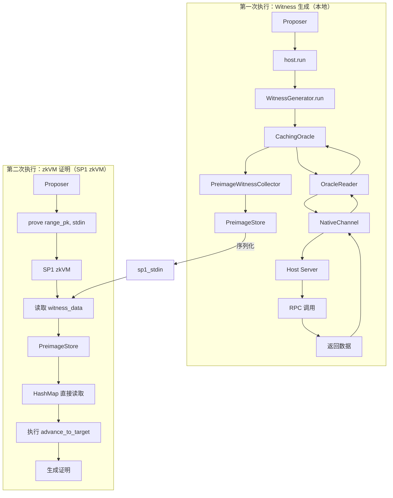
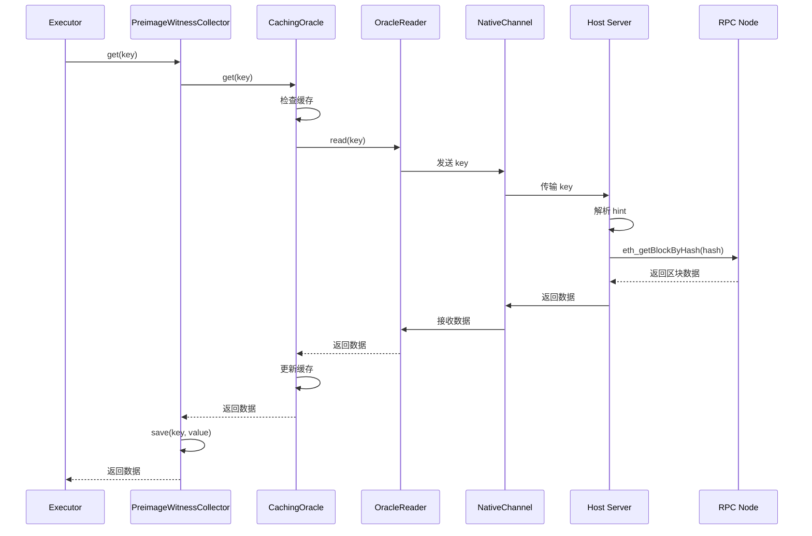
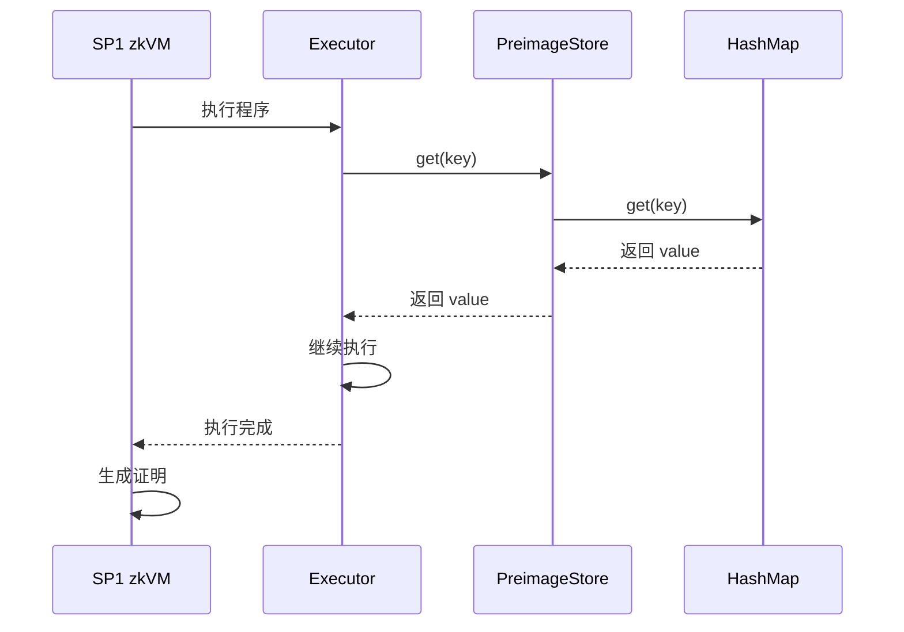

# Witness 生成与 zkVM 执行流程详解

## 目录

1. [概述](#概述)
2. [两次执行架构](#两次执行架构)
3. [第一次执行：Witness 生成](#第一次执行witness-生成)
4. [第二次执行：zkVM 证明生成](#第二次执行zkvm-证明生成)
5. [关键区别对比](#关键区别对比)
6. [数据流向图](#数据流向图)
7. [为什么需要两次执行](#为什么需要两次执行)

---

## 概述

在 `prove_game` 流程中，状态转换逻辑会**执行两次**：

1. **第一次执行（Witness 生成）**：在本地执行，通过 Host-Client 架构收集所有外部数据访问（preimage 请求），生成 witness data
2. **第二次执行（zkVM 证明生成）**：在 SP1 zkVM 中执行，使用预收集的 witness data，生成零知识证明

两次执行使用**相同的代码逻辑**（`advance_to_target()`），但使用**不同的 Oracle 机制**来获取数据。

---

## 两次执行架构

### 架构对比图



---

## 第一次执行：Witness 生成

### 执行入口

```rust
// fault-proof/src/proposer.rs:735
let witness_data = self.host.run(&host_args).await?;
```

### 详细流程

#### 1. Host-Client 架构初始化

```rust
// utils/host/src/host.rs:91-106
async fn run(&self, args: &Self::Args) -> Result<WitnessData> {
    // 1.1 创建双向通道
    let preimage = BidirectionalChannel::new()?;  // 用于 preimage 数据
    let hint = BidirectionalChannel::new()?;      // 用于 hint 信息
    
    // 1.2 启动 Host Server（作为 preimage oracle）
    let server_task = args.start_server(hint.host, preimage.host).await?;
    // Host Server 监听 channel，等待 preimage 请求
    
    // 1.3 运行 Client（Witness Executor）
    let witness = self.witness_generator().run(preimage.client, hint.client).await?;
    
    // 1.4 终止服务器
    server_task.abort();
    
    Ok(witness)
}
```

**通道说明**：
- `preimage.host` / `preimage.client`：用于传输 preimage 数据（key → value）
- `hint.host` / `hint.client`：用于传输 hint 信息（告诉 Host Server 数据类型）

#### 2. Oracle 机制初始化

```rust
// utils/host/src/witness_generation/traits.rs:43-53
let preimage_oracle = Arc::new(CachingOracle::new(
    2048,                                    // 缓存大小
    OracleReader::new(preimage_chan),        // 从 channel 读取 preimage
    HintWriter::new(hint_chan),              // 向 channel 写入 hint
));

let oracle = Arc::new(PreimageWitnessCollector {
    preimage_oracle: preimage_oracle.clone(),
    preimage_witness_store: preimage_witness_store.clone(),
});
```

**组件说明**：
- **`CachingOracle`**：包装 `OracleReader` 和 `HintWriter`，提供缓存功能
- **`OracleReader`**：通过 `NativeChannel` 从 Host Server 读取 preimage
- **`HintWriter`**：通过 `NativeChannel` 向 Host Server 发送 hint
- **`PreimageWitnessCollector`**：包装 oracle，自动保存所有 preimage 请求到 `PreimageStore`

#### 3. PreimageWitnessCollector 的工作原理

```rust
// utils/host/src/witness_generation/preimage_witness_collector.rs:21-25
async fn get(&self, key: PreimageKey) -> PreimageOracleResult<Vec<u8>> {
    // 3.1 从底层 oracle 获取数据（触发 Host Server 请求）
    let value = self.preimage_oracle.get(key).await?;
    
    // 3.2 保存到 witness store（用于后续证明）
    self.save(key, &value);
    
    Ok(value)
}
```

**流程**：
1. Client 调用 `oracle.get(key)`
2. `PreimageWitnessCollector` 调用底层 `CachingOracle.get()`
3. `CachingOracle` 检查缓存，未命中则调用 `OracleReader.read()`
4. `OracleReader` 通过 `NativeChannel` 发送 key 到 Host Server
5. Host Server 接收 key，根据 hint 知道数据类型，调用 RPC 获取数据
6. Host Server 通过 channel 返回数据
7. `PreimageWitnessCollector` 保存 key-value 到 `PreimageStore`
8. 返回数据给调用者

#### 4. 状态转换执行

```rust
// utils/client/src/witness/executor.rs:114-152
async fn run<O, DP, P>(
    &self,
    boot: BootInfo,
    pipeline: DP,
    cursor: Arc<RwLock<PipelineCursor>>,
    l2_provider: OracleL2ChainProvider<O>,
) -> Result<BootInfo>
where
    O: CommsClient + FlushableCache + Send + Sync + Debug,
{
    // 4.1 创建 Kona Executor
    let executor = KonaExecutor::new(
        rollup_config.as_ref(),
        l2_provider.clone(),
        l2_provider,
        ZkvmOpEvmFactory::new(),
        None,
    );
    
    // 4.2 创建 Driver
    let mut driver = Driver::new(cursor, executor, pipeline);
    
    // 4.3 执行到目标区块
    let (safe_head, output_root) = advance_to_target(
        &mut driver,
        rollup_config.as_ref(),
        Some(boot.claimed_l2_block_number),
    )
    .await?;
    
    Ok(boot_clone)
}
```

#### 5. advance_to_target 执行流程

```rust
// utils/client/src/client.rs:51-182
pub async fn advance_to_target<E, DP, P>(
    driver: &mut Driver<E, DP, P>,
    cfg: &RollupConfig,
    mut target: Option<u64>,
) -> DriverResult<(L2BlockInfo, B256), E::Error> {
    loop {
        // 5.1 Pipeline 产生 payload（需要 L1 batch 数据）
        let mut attributes = match driver.pipeline.produce_payload(...).await {
            // 内部会调用 OracleL1ChainProvider 的方法
            // 例如：header_by_hash(block_hash)
            // 这会触发 preimage 请求
        };
        
        // 5.2 Executor 执行 payload（需要 L2 状态数据）
        let outcome = driver.executor.execute_payload(attributes.clone()).await {
            // 内部会调用 OracleL2ChainProvider 的方法
            // 例如：get_block_by_number(block_number)
            // 这会触发 preimage 请求
        };
        
        // 5.3 更新 cursor
        driver.cursor.write().advance(origin, tip_cursor);
    }
}
```

**Preimage 请求触发点**：

1. **Pipeline 产生 payload**（需要 L1 区块数据）：
   ```rust
   // 伪代码示例
   pipeline.produce_payload()
       → OracleL1ChainProvider.header_by_hash(block_hash)
           → oracle.get(PreimageKey::new_keccak256(block_hash))
               → PreimageWitnessCollector.get()
                   → CachingOracle.get()
                       → OracleReader.read()  // 通过 channel 请求
   ```

2. **Executor 执行 payload**（需要 L2 区块数据）：
   ```rust
   // 伪代码示例
   executor.execute_payload()
       → OracleL2ChainProvider.get_block_by_number(block_number)
           → oracle.get(PreimageKey::new_keccak256(block_hash))
               → PreimageWitnessCollector.get()
                   → CachingOracle.get()
                       → OracleReader.read()  // 通过 channel 请求
   ```

3. **读取账户信息**（需要账户 proof）：
   ```rust
   // 伪代码示例
   executor.execute_payload()
       → 需要读取账户状态（nonce、balance、code hash 等）
           → 发送 hint: L2AccountProof(block_number, address)
           → Host Server 处理 hint
               → RPC: eth_getProof(address, [], block_number)
               → 存储 account_proof 的所有 trie 节点到 KV store
           → oracle.get(PreimageKey::new_keccak256(node_hash))
               → PreimageWitnessCollector.get()
                   → CachingOracle.get()
                       → OracleReader.read()  // 读取 trie 节点
   ```

4. **读取/修改 Storage**（需要 storage proof）：
   ```rust
   // 伪代码示例
   executor.execute_payload()
       → 需要读取或修改 storage slot
           → 发送 hint: L2AccountStorageProof(block_number, address, slot)
           → Host Server 处理 hint
               → RPC: eth_getProof(address, [slot], block_number)
               → 存储 account_proof 和 storage_proof 的所有 trie 节点到 KV store
           → oracle.get(PreimageKey::new_keccak256(node_hash))
               → PreimageWitnessCollector.get()
                   → CachingOracle.get()
                       → OracleReader.read()  // 读取 trie 节点
   ```

**关键点**：
- **账户读取**：当执行交易需要访问账户状态时（如检查 balance、nonce），会触发 `L2AccountProof` hint，获取从 state root 到账户路径上的所有 trie 节点
- **Storage 读取/修改**：当执行交易需要读取或修改 storage slot 时，会触发 `L2AccountStorageProof` hint，获取账户 proof 和 storage proof 的所有 trie 节点
- **Hint 机制**：通过 hint 提前告知 Host Server 需要哪些数据，Host Server 通过 RPC 获取并存储所有相关的 trie 节点，后续通过 preimage key 直接读取

#### 6. Host Server 处理请求

```rust
// Host Server 端（kona-host 进程）
loop {
    // 6.1 读取 hint
    let hint = hint_channel.read().await?;
    // hint 示例: "L1BlockHeader:0x1234..."
    
    // 6.2 读取 preimage key
    let key = preimage_channel.read().await?;
    // key: PreimageKey (32 bytes)
    
    // 6.3 根据 hint 和 key 获取数据
    let value = match hint_type {
        HintType::L1BlockHeader => {
            let block_hash = extract_hash_from_hint(hint);
            l1_rpc.get_block_by_hash(block_hash).await?
        }
        HintType::L2BlockHeader => {
            let block_hash = extract_hash_from_hint(hint);
            l2_rpc.get_block_by_hash(block_hash).await?
        }
        // ...
    };
    
    // 6.4 返回数据
    preimage_channel.write(value).await?;
}
```

#### 7. Witness Data 收集完成

```rust
// utils/host/src/witness_generation/traits.rs:76-79
let witness = Self::WitnessData::from_parts(
    preimage_witness_store.lock().unwrap().clone(),  // 所有 preimage
    blob_data.lock().unwrap().clone(),               // 所有 blob 数据
);

Ok(witness)
```

**Witness Data 结构**：
```rust
pub struct DefaultWitnessData {
    pub preimage_store: PreimageStore,  // HashMap<PreimageKey, Vec<u8>>
    pub blob_data: BlobData,             // Vec<Blob>, commitments, proofs
}
```

---

## 第二次执行：zkVM 证明生成

### 执行入口

```rust
// fault-proof/src/proposer.rs:737-743
let sp1_stdin = self.host.witness_generator().get_sp1_stdin(witness_data)?;

// fault-proof/src/proposer.rs:784
let proof = self.prover.network_prover
    .prove(&self.prover.range_pk, &sp1_stdin)
    .compressed()
    .skip_simulation(true)
    .run_async()
    .await?;
```

### 详细流程

#### 1. Witness Data 序列化

```rust
// utils/ethereum/host/src/witness_generator.rs:31-36
fn get_sp1_stdin(&self, witness: Self::WitnessData) -> Result<SP1Stdin> {
    let mut stdin = SP1Stdin::new();
    // 使用 rkyv 序列化 witness data
    let buffer = to_bytes::<rkyv::rancor::Error>(&witness)?;
    stdin.write_slice(&buffer);
    Ok(stdin)
}
```

**序列化内容**：
- `PreimageStore`：所有 preimage 的 key-value 对
- `BlobData`：所有 blob 数据、commitments、proofs

**关键点**：
- **PreimageStore 包含所有需要的数据**：在第一次执行时，所有通过 preimage oracle 请求的数据（L1 区块头、L2 区块数据、账户 proof、storage proof 等）都已收集并存储在 PreimageStore 中
- **无需外部访问**：在第二次执行（zkVM 执行）时，程序直接从 PreimageStore 的 HashMap 中读取数据，**不再需要访问 L1 或 L2 RPC**，所有数据都是自包含的（self-contained）

#### 2. SP1 zkVM 程序入口

```rust
// programs/range/ethereum/src/main.rs:19-35
fn main() {
    kona_proof::block_on(async move {
        // 2.1 从 stdin 读取 witness data
        let witness_rkyv_bytes: Vec<u8> = sp1_zkvm::io::read_vec();
        
        // 2.2 反序列化 witness data
        let witness_data = rkyv::from_bytes::<DefaultWitnessData, Error>(&witness_rkyv_bytes)
            .expect("Failed to deserialize witness data.");
        
        // 2.3 从 witness data 恢复 oracle 和 blob provider
        let (oracle, beacon) = witness_data
            .get_oracle_and_blob_provider()
            .await
            .expect("Failed to load oracle and blob provider");
        // oracle 是 PreimageStore，不是 CachingOracle！
        
        // 2.4 执行 range program
        run_range_program(ETHDAWitnessExecutor::new(), oracle, beacon).await;
    });
}
```

#### 3. 恢复 Oracle 和 Blob Provider

```rust
// utils/client/src/witness/mod.rs:24-41
async fn get_oracle_and_blob_provider(self) -> Result<(Arc<PreimageStore>, BlobStore)> {
    let (owned_preimage_store, owned_blob_data) = self.into_parts();
    
    // 3.1 验证 preimages 的正确性
    println!("cycle-tracker-report-start: oracle-verify");
    owned_preimage_store.check_preimages()
        .expect("Failed to validate preimages");
    println!("cycle-tracker-report-end: oracle-verify");
    
    // 3.2 创建 PreimageStore 的 Arc
    let oracle = Arc::new(owned_preimage_store);
    
    // 3.3 创建 BlobStore 并验证
    println!("cycle-tracker-report-start: blob-verification");
    let beacon = BlobStore::from(owned_blob_data);
    println!("cycle-tracker-report-end: blob-verification");
    
    Ok((oracle, beacon))
}
```

**关键点**：
- `oracle` 是 `PreimageStore` 类型，不是 `CachingOracle`
- `PreimageStore` 实现了 `PreimageOracleClient` trait，可以直接作为 oracle 使用
- **数据自包含**：PreimageStore 是一个 HashMap，包含了第一次执行时收集的所有 preimage 数据（L1 区块头、L2 区块数据、账户 proof、storage proof 等）
- **无需外部访问**：在 zkVM 执行时，所有数据都从 PreimageStore 的 HashMap 中直接读取，**完全不需要访问 L1 或 L2 RPC**，这确保了证明的可重现性和确定性

#### 4. PreimageStore 作为 Oracle

```rust
// utils/client/src/witness/preimage_store.rs:59-65
#[async_trait]
impl PreimageOracleClient for PreimageStore {
    async fn get(&self, key: PreimageKey) -> PreimageOracleResult<Vec<u8>> {
        // 直接从 HashMap 读取，不通过 channel！
        let Some(value) = self.preimage_map.get(&key) else {
            return Err(PreimageOracleError::InvalidPreimageKey);
        };
        Ok(value.clone())
    }
    
    async fn get_exact(&self, key: PreimageKey, buf: &mut [u8]) -> PreimageOracleResult<()> {
        buf.copy_from_slice(&self.get(key).await?);
        Ok(())
    }
}
```

**关键区别**：
- **第一次执行**：`CachingOracle` → `OracleReader` → `NativeChannel` → Host Server → RPC
- **第二次执行**：`PreimageStore` → `HashMap` → 直接返回

#### 5. 执行相同的状态转换逻辑

```rust
// programs/range/utils/src/lib.rs:23-58
pub async fn run_range_program<E>(executor: E, oracle: Arc<PreimageStore>, beacon: BlobStore)
where
    E: WitnessExecutor<...>,
{
    // 5.1 获取 pipeline 输入
    let (boot_info, input) = get_inputs_for_pipeline(oracle.clone()).await.unwrap();
    
    if let Some((cursor, l1_provider, l2_provider)) = input {
        // 5.2 创建 pipeline
        let pipeline = executor.create_pipeline(
            rollup_config,
            l1_config,
            cursor.clone(),
            oracle,      // PreimageStore
            beacon,
            l1_provider, // OracleL1ChainProvider<PreimageStore>
            l2_provider, // OracleL2ChainProvider<PreimageStore>
        ).await.unwrap();
        
        // 5.3 执行到目标区块（相同的逻辑！）
        executor.run(boot_info, pipeline, cursor, l2_provider).await.unwrap();
    }
    
    // 5.4 提交 public values
    sp1_zkvm::io::commit(&BootInfoStruct::from(boot_info));
}
```

**执行流程**：
1. 调用 `advance_to_target()`（与第一次执行相同的代码）
2. `pipeline.produce_payload()` 需要 L1 数据
3. `OracleL1ChainProvider` 调用 `oracle.get(key)`
4. `PreimageStore.get()` 直接从 HashMap 读取
5. `executor.execute_payload()` 需要 L2 数据
6. `OracleL2ChainProvider` 调用 `oracle.get(key)`
7. `PreimageStore.get()` 直接从 HashMap 读取
8. 执行完成，提交 public values

#### 6. 生成零知识证明

SP1 zkVM 在执行程序时：
1. 记录所有 RISC-V 指令执行
2. 生成执行轨迹（execution trace）
3. 转换为算术电路
4. 生成 STARK proof（Compressed 模式）
5. 压缩为 SNARK proof
6. 返回 `SP1ProofWithPublicValues`

---

## 关键区别对比

### 执行环境对比

| 方面 | 第一次执行 | 第二次执行 |
|------|----------|----------|
| **环境** | 本地进程 | SP1 zkVM |
| **目的** | 收集 witness | 生成证明 |
| **确定性** | 需要外部 RPC | 完全确定性 |

### Oracle 机制对比

| 方面 | 第一次执行 | 第二次执行 |
|------|----------|----------|
| **Oracle 类型** | `CachingOracle` | `PreimageStore` |
| **数据来源** | Host Server (RPC) | HashMap (预填充) |
| **通信方式** | `NativeChannel` | 内存访问 |
| **请求流程** | key → channel → RPC → value | key → HashMap → value |
| **缓存** | 有（2048 项） | 无（全部预加载） |

### 代码路径对比

| 组件 | 第一次执行 | 第二次执行 |
|------|----------|----------|
| **入口** | `host.run()` | `prove(range_pk, stdin)` |
| **Oracle 创建** | `CachingOracle::new()` | `PreimageStore` (从 witness) |
| **数据获取** | `OracleReader.read()` | `PreimageStore.get()` |
| **执行逻辑** | `advance_to_target()` | `advance_to_target()` (相同) |
| **输出** | `WitnessData` | `SP1Proof` |

### 数据流向对比

**第一次执行**：
```
执行逻辑
  ↓
需要数据
  ↓
PreimageWitnessCollector.get(key)
  ↓
CachingOracle.get(key)
  ↓ (缓存未命中)
OracleReader.read(key)
  ↓
NativeChannel 发送 key
  ↓
Host Server 接收 key
  ↓
根据 hint 调用 RPC
  ↓
返回数据
  ↓
NativeChannel 接收数据
  ↓
保存到 PreimageStore
  ↓
返回给调用者
```

**第二次执行**：
```
执行逻辑
  ↓
需要数据
  ↓
PreimageStore.get(key)
  ↓
HashMap.get(key)
  ↓
直接返回 value
```

---

## 数据流向图

### 第一次执行：Witness 生成



### 第二次执行：zkVM 证明生成



---

## 为什么需要两次执行

### 1. zkVM 的确定性要求

**问题**：zkVM 需要完全确定性的执行，不能有外部依赖。

**解决方案**：
- 第一次执行：收集所有外部数据访问
- 第二次执行：使用预收集的数据，完全确定性

### 2. 证明的可验证性

**问题**：验证者需要能够验证证明的正确性，但不能信任 prover 提供的数据。

**解决方案**：
- Witness data 中的 preimage 都经过哈希验证
- 验证者可以验证 preimage 的正确性（通过哈希）
- 证明证明了：给定这些 preimage，执行结果是正确的

### 3. 效率考虑

**问题**：如果每次都在 zkVM 中通过 RPC 获取数据，会非常慢。

**解决方案**：
- 第一次执行：快速收集数据（本地 RPC）
- 第二次执行：快速执行（内存访问）

### 4. 架构设计

**问题**：如何让相同的代码在两种环境下运行？

**解决方案**：
- 使用 trait 抽象（`PreimageOracleClient`）
- 第一次：`CachingOracle` 实现 trait
- 第二次：`PreimageStore` 实现 trait
- 执行逻辑代码完全相同

---

## 总结

1. **两次执行使用相同的代码逻辑**（`advance_to_target()`），但使用不同的 Oracle 实现
2. **第一次执行**：通过 Host-Client 架构收集 witness data，所有 preimage 请求都被记录
3. **第二次执行**：在 zkVM 中使用预收集的 witness data，直接从 HashMap 读取数据
4. **关键区别**：Oracle 机制不同（channel vs HashMap），但接口相同（trait）
5. **设计优势**：代码复用、确定性保证、效率优化

这种设计确保了：
- ✅ 代码复用（相同的执行逻辑）
- ✅ 确定性执行（预收集的数据）
- ✅ 可验证性（preimage 哈希验证）
- ✅ 高效执行（内存访问 vs RPC）

