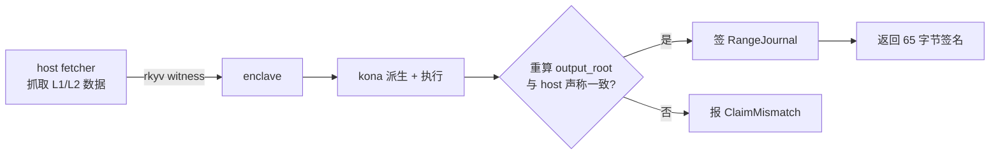
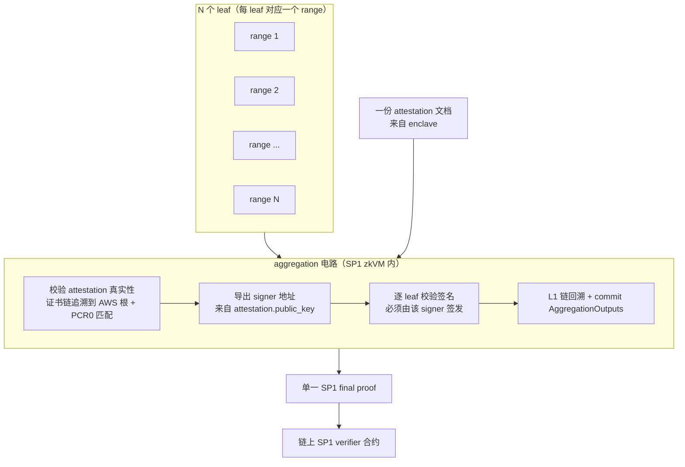
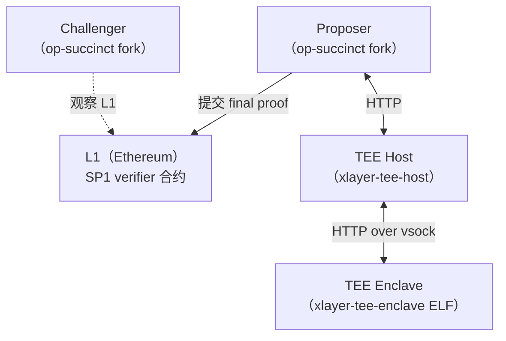
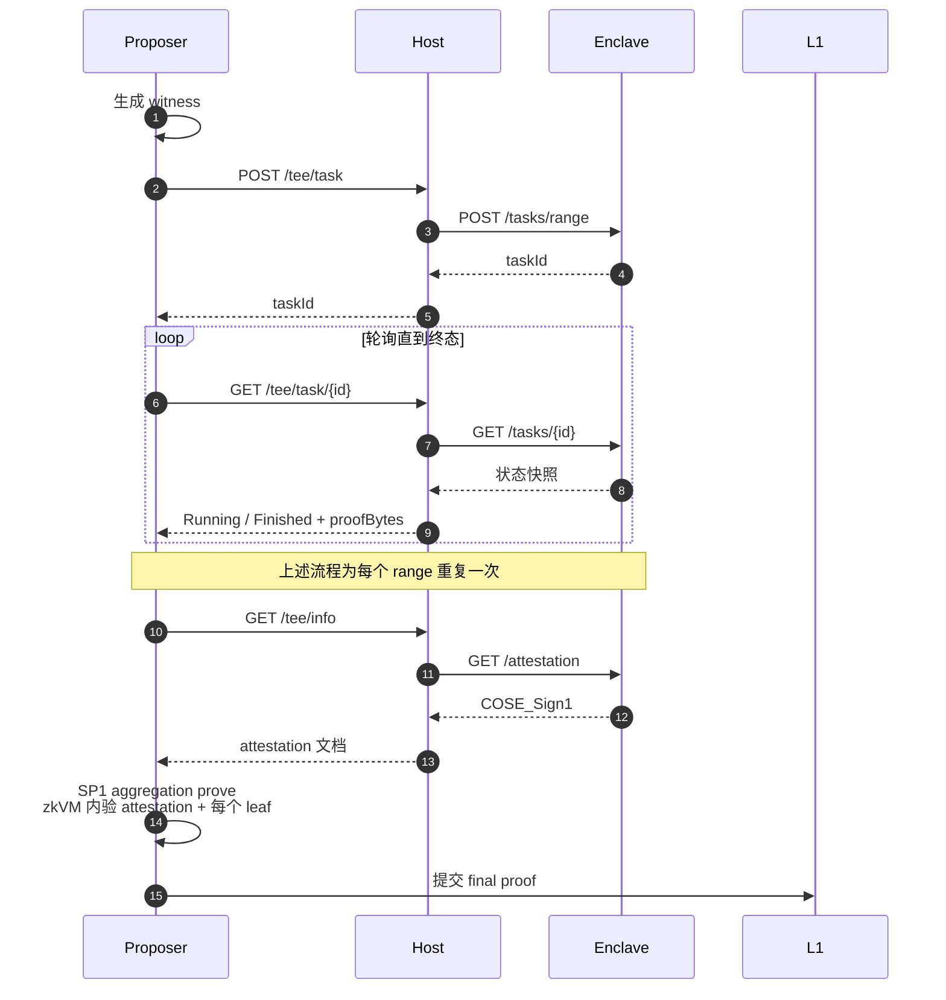
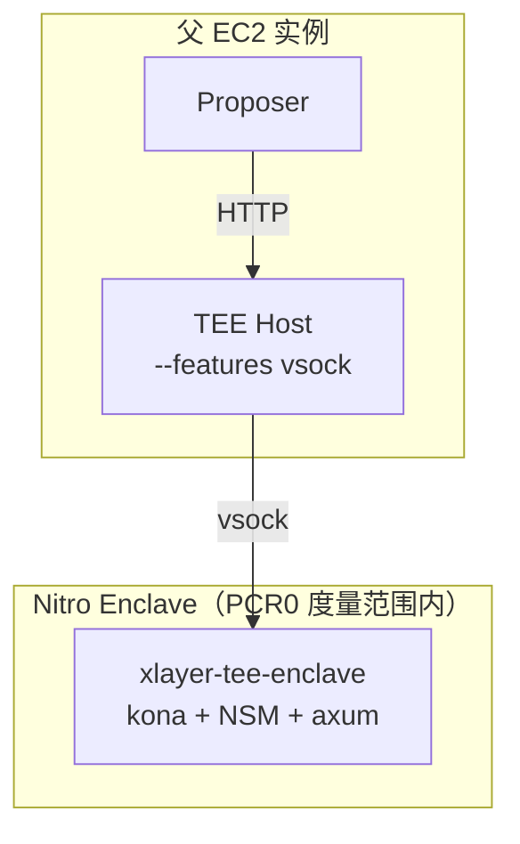
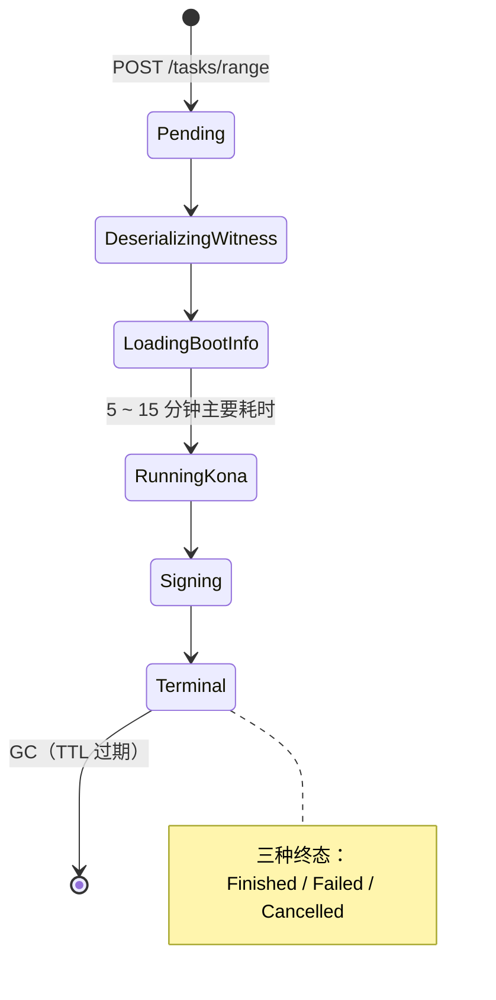
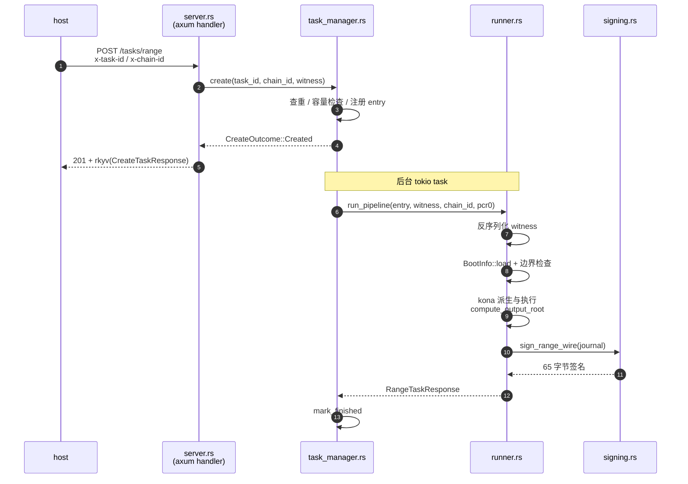
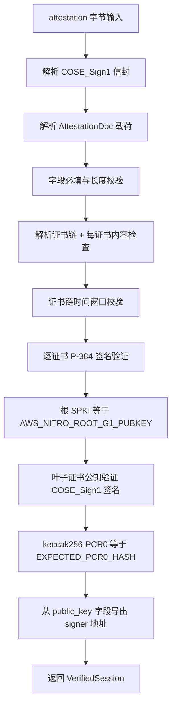
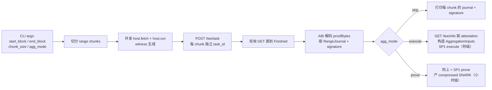

# X Layer TEE Proof 设计文档

本文描述 X Layer 在 OP Stack 主链之外引入的一条独立可信证明路径：基于 AWS Nitro Enclave 的 TEE 证明。文档对应当前代码状态——`op-succinct` 仓库中 `programs/aggregation/`、`tee/` 与 `utils/client/` 的实现。

---

## 1. 术语解释

按主题分组。阅读后续章节时遇到陌生词可回查这里。

### 1.1 OP Stack / Rollup 基础

| 术语 | 说明 |
|---|---|
| L1 / L2 | L1 指以太坊主网，L2 是建在 L1 之上的扩容链。X Layer 是 L2 |
| OP Stack | Optimism 主导的开源 L2 框架，X Layer 基于此 |
| Rollup | 将 L2 交易压缩后批量提交到 L1 的扩容方案 |
| Sequencer | L2 出块节点 |
| Proposer | 周期性把 L2 状态承诺推到 L1 的角色 |
| Challenger | 监督 Proposer 提交是否正确，发现错误时发起挑战的角色 |
| Fault Proof | rollup 的安全机制：任何人都可在 L1 上挑战错误的 L2 状态提交 |
| Dispute Game | Fault Proof 的具体协议形态，在 L1 上以博弈方式定胜负 |
| Output Root | L2 状态的 Merkle root 承诺；每个 L2 block 都对应一个 |
| Derivation | 从 L1 数据（calldata、blob）与 rollup config 重建 L2 block 序列的过程 |
| Kona | OP Stack 官方 Rust 派生与执行库 |
| Rollup Config | L2 链配置（创世时间、硬分叉时间表等），哈希后写入 RangeJournal |

### 1.2 AWS Nitro Enclave 基础

| 术语 | 说明 |
|---|---|
| TEE | 可信执行环境的统称。一类硬件机制，使应用运行在由硬件度量并签名的隔离环境中 |
| AWS Nitro Enclave | AWS 提供的 TEE 实现。从 EC2 主机中划出一个隔离 VM，没有网络、没有持久化磁盘，仅可通过 vsock 与父 EC2 通信 |
| NSM | Nitro Secure Module。Nitro 内的硬件信任根，向 enclave 提供 attestation 文档和随机熵 |
| PCR0 | NSM 对 enclave 镜像做的 SHA-384 度量，48 字节。镜像变化则 PCR0 变化 |
| EIF | Enclave Image File。`nitro-cli build-enclave` 产出的镜像文件，PCR0 由其字节决定 |
| vsock | Linux 虚拟机间通信套接字。Nitro Enclave 与父 EC2 之间唯一的数据通道 |
| ENCLAVE_KEY | enclave 应用启动时随机生成的 secp256k1 私钥。进程级生命周期，重启即变 |
| Attestation | NSM 颁发的签名文档，将 ENCLAVE_KEY 公钥、PCR0、时间戳等绑定，并由 NSM 私钥签发 |
| COSE_Sign1 | RFC 8152 定义的 CBOR 单签名信封格式，AWS Nitro 用其包裹 attestation |
| CBOR | Concise Binary Object Representation，紧凑二进制数据格式 |
| AWS Nitro Root-G1 | AWS 公开的 P-384 根证书公钥，96 字节。所有 Nitro NSM 的证书链最终追溯至此 |

### 1.3 密码学与编码

| 术语 | 说明 |
|---|---|
| secp256k1 | 以太坊使用的椭圆曲线。ENCLAVE_KEY 使用 |
| P-384 | NIST 标准曲线。AWS Nitro PKI 使用 |
| ECDSA | 椭圆曲线数字签名算法。本设计两条曲线均采用 ECDSA |
| SEC1 | 椭圆曲线公钥编码标准。65 字节未压缩格式为 `0x04 \|\| X \|\| Y` |
| DER | X.509 证书的二进制编码格式 |
| ecrecover | 从 secp256k1 签名与消息摘要恢复签名者以太坊地址的过程，EVM 原生支持 |
| keccak256 | 以太坊使用的哈希函数 |
| rkyv | Rust 零拷贝序列化库，host ↔ enclave 通信与 SP1 stdin 均采用 |

### 1.4 ZK 与 SP1

| 术语 | 说明 |
|---|---|
| ZK / 零知识证明 | 一种密码学构造：证明者证明某段计算正确执行，验证者不需重跑即可校验 |
| zkVM | 零知识虚拟机。可执行任意程序并产出"我确实正确执行了这段代码"的 ZK 证明 |
| SP1 | Succinct Labs 的 zkVM 实现 |
| ELF | 二进制可执行格式。本设计涉及两个 ELF：`xlayer-tee-enclave`（TEE prover）与 `aggregation`（SP1 guest） |
| vkey | SP1 verification key，与一份 deterministic build 的 ELF 一一对应；链上 SP1 verifier 合约存储的即此 |
| Aggregation Program | op-succinct 既有 SP1 程序（`programs/aggregation`），将 N 个 range proof 收敛为单个 final proof |
| Leaf | aggregation 电路视角下，每个 range proof 是一个 leaf。N 个 range 对应 N 个 leaf |
| L1 Walk | aggregation 电路在 zkVM 内回溯一段 L1 区块头链，验证每个 range 的 l1Head 都在链上 |
| AggregationOutputs | aggregation 电路 commit 的最终输出（L2 起止 root、L1 head、rollup config hash 等），上链由 SP1 verifier 校验 |

### 1.5 本设计特有的术语

| 术语 | 说明 |
|---|---|
| TEE Proof | 以 TEE 硬件签名替代 ZK 证明，用于证明 L2 状态转移正确性 |
| Range | 一段连续的 L2 block。本设计以几百到上千个 block 为单位 |
| Range Proof | 对一个 range 的状态转移正确性的证明。两种变体：`RangeProof::Sp1`（ZK 证明）或 `RangeProof::Tee`（TEE 签名） |
| RangeJournal | enclave 签名的 7 字段承诺数据：`pcr0`、`chainId`、`configHash`、`l1OriginHash`、`l2BlockNumber`、`prevOutputRoot`、`outputRoot` |
| Packed Journal | RangeJournal 的固定 176 字节大端序打包形式，签名摘要 = `keccak256(packed)` |
| Witness | host fetcher 产出的 rkyv 数据包，包含 kona 运行 range program 所需的全部输入 |
| BootInfoStruct | 单 range 的运行参数：起止 output root、L2 block number、L1 head、rollup config hash |
| Claim | host 提供给 enclave 的"该 range 的 output root 应为 X"的声明值。enclave 重算后与之比对，不匹配则 `ClaimMismatch` |
| Trust Anchor | 不能被推翻的根信任源。本设计为烤入 aggregation ELF 的两个常量：`EXPECTED_PCR0_HASH` 与 `AWS_NITRO_ROOT_G1_PUBKEY` |
| VerifiedSession | aggregation guest 验证 attestation 后导出的结构，包含 `signer` 地址。本次聚合内所有 TEE leaf 必须 ecrecover 到该 signer |
| chainId | L2 链 id。enclave 通过 `x-chain-id` header 接收，aggregation 通过 `AggregationInputs.tee_chain_id` 接收。两端必须一致，ecrecover 才能成功 |
| op-succinct | OP Stack 的 ZK proof 上游实现仓库。本设计大量复用其 range program、aggregation 电路、witness 类型 |

---

## 2. 背景

### 2.1 为什么需要 TEE Proof

X Layer 是基于 OP Stack 的 L2 链。OP Stack 的安全模型依赖 fault proof：当有人提交错误的 L2 状态时，挑战者可在 L1 发起 dispute game 推翻。这一机制需要一种**高效**的方式证明 "正确的 L2 状态转移应为 X"。

当前业界主流是 ZK 路径：通过 zkVM（如 SP1）证明 "我重放了 N 个 block 的状态转移，最终 output root 等于 X"。但 ZK 路径存在两类工程风险：

- **电路 bug 风险**。zkVM 或电路实现若存在 soundness bug，攻击者可能伪造看似正确的 proof
- **vkey 治理风险**。链上 verifier 合约存储的 vkey 一旦被错误升级，整条 ZK 信任链失效

为了对冲这两个风险，X Layer 引入一条与 ZK 完全独立的可信路径，作为 fault proof 的第二条 game type。本设计基于 AWS Nitro Enclave 构造这条路径：不依赖任何 ZK 电路或新的密码学原语，仅依赖 AWS Nitro 的硬件信任根与 enclave 镜像度量。

### 2.2 与上游与旁路实现的关系

本设计大量复用既有代码。基线是 op-succinct（OP Stack 的 ZK 路径上游）与 kona（OP Stack 的派生与执行库）。

| 维度 | 复用对象 | 复用方式 |
|---|---|---|
| Range program 执行引擎 | upstream kona | enclave 内直接调用，与 op-succinct SP1 range program 共享同一份代码 |
| Witness 数据格式 | op-succinct `DefaultWitnessData`（rkyv 序列化） | host 字节透传，enclave 反序列化即用 |
| Aggregation 电路 | op-succinct `programs/aggregation` | 新增 `RangeProof::Tee` 变体与 attestation 验证子模块 |
| 链上 verifier 合约 | op-succinct 既有 SP1 verifier | TEE 路径通过 vkey 间接绑定，不新增合约 |
| host ↔ enclave 传输栈 | tradezone 已在生产验证的 HTTP-over-vsock 实现 | 整体借鉴，避免重复造轮子 |
| Nitro 原语 | 上游 crate（`k256` / `aws-nitro-enclaves-nsm-api` / `tokio-vsock`） | 直接依赖，不通过第三方封装层 |

有三处刻意**不**复用 base（Coinbase OP Stack 实现中的 TEE 路径）：执行引擎改用 kona、host ↔ enclave 协议改为 REST + rkyv、聚合放在 SP1 电路内而非 enclave 内。完整对照见附录 A。

---

## 3. 整体方案

### 3.1 单 range：enclave 内重放并签名

将 L2 区间切分为若干 range（典型尺寸：几百到上千个 block），每个 range 独立完成下列流程：



要点：

- enclave **不连外网**。全部输入来自 host 投递的 witness
- enclave 内运行完整 kona 派生与 EVM 执行，独立重算 output root
- 重算结果与 host 声称值一致时方才签名，否则拒绝
- 签名所用私钥（ENCLAVE_KEY）由 enclave 启动时随机生成，外部不可预知
- 签名算法为 secp256k1 ECDSA，digest = `keccak256(packed RangeJournal)`

### 3.2 多 range：通过 SP1 聚合电路收敛

一个 epoch 包含成千上万个 L2 block，会被切成 N 个 range 各自获取 TEE 签名。最终需要把 N 个独立签名收敛为单个上链证明。这一步**不在 enclave 内完成**，而是复用 op-succinct 既有的 SP1 aggregation 电路：



将聚合放在 SP1 电路而非 enclave 内的考量：

- enclave 内做聚合需要 enclave 持有多 range 状态，会扩大其攻击面与 PCR0 度量面积
- SP1 已提供成熟的 aggregation 电路与 L1 walk 验证逻辑，直接复用即可
- TEE leaf 的签名验证在 zkVM 内使用 SP1 的 secp256k1 precompile，单 leaf 的代价基本可以忽略
- SP1 与 TEE 两种 leaf 可在同一次聚合中混用，例如部分 range 走 ZK、部分走 TEE，便于按需降级或双轨并行

### 3.3 信任锚：动态 signer 加静态 PCR0 与根证书

aggregation 电路如何确信收到的签名"确实来自合法 enclave"？答案分两层。

**静态层**：aggregation ELF 内烤入两个常量，作为信任根：

```rust
// programs/aggregation/src/main.rs
const EXPECTED_PCR0_HASH:       B256       = b256!("c980...d293");
const AWS_NITRO_ROOT_G1_PUBKEY: [u8; 96]   = hex!("fc02...3ff4");
```

任一常量变化都会导致 ELF 变化，进而 vkey 变化，最终需要通过治理流程升级链上合约。

**动态层**：aggregation 电路在 zkVM 内每次都重新验证一份 attestation，按如下顺序：

1. 读取输入中的 attestation 文档
2. 验证其证书链根追溯到 `AWS_NITRO_ROOT_G1_PUBKEY`，证明该文档由真实的 AWS Nitro 硬件签发
3. 验证文档内的 PCR0 等于 `EXPECTED_PCR0_HASH`，证明签发文档时 NSM 正运行**当前 ELF 对应的** enclave 镜像
4. 从文档 `public_key` 字段导出 signer 地址
5. 后续每个 TEE leaf 的 ecrecover 结果必须等于该 signer

**结果**：电路里没有静态的 enclave 公钥白名单。signer 每次都从当下的 attestation 现场提取。enclave 重启或密钥轮换不影响安全性，只要 PCR0 不变即可。完整的电路逻辑见 §5.4。

---

## 4. 角色与系统拓扑

### 4.1 四角色

整条 TEE 路径由四个解耦的角色组成：



| 角色 | 实现位置 | 职责 |
|---|---|---|
| Proposer | op-succinct fork | 生成 witness、调度 host、收齐 N 个 range proof、获取 attestation、运行 SP1 aggregation、上链 |
| Host | `op-succinct/tee/host` | proposer 与 enclave 之间的协调层；witness 字节透传；任务生命周期映射；attestation 缓存；`proofBytes` 打包 |
| Enclave | `op-succinct/tee/enclave` | 运行 kona 派生与执行；对 RangeJournal 签名；NSM attestation；异步任务管理 |
| Challenger | op-succinct fork | 仅读 L1，监控 dispute game 状态，与 host / enclave 完全解耦 |

### 4.2 端到端时序



### 4.3 真机部署



部署流程：

1. `cargo build --release --features vsock -p xlayer-tee-enclave` 编译 Linux x86_64 二进制
2. `nitro-cli build-enclave --docker-uri ... --output-file enclave.eif` 打包 EIF，记录输出的 PCR0
3. 将 `keccak256(PCR0)` 写入 `programs/aggregation/src/main.rs` 的 `EXPECTED_PCR0_HASH`
4. `cargo prove build --bin aggregation` 生成新 vkey
5. 治理多签将新 vkey 写入链上 SP1 verifier
6. 父 EC2 通过 `nitro-cli run-enclave` 启动 enclave
7. enclave 启动后随机生成 ENCLAVE_KEY，调用 NSM 获取 attestation 与 PCR0，并在 vsock 上监听 axum
8. 父 EC2 启动 proposer 与 host；host 以 `--features vsock` 模式连接 enclave

---

## 5. 模块详细设计

本章逐一描述 TEE 路径涉及的模块。模块的对外接口（HTTP 端点）统一放在第 6 章接口规范，这里只关心架构与内部组织。

> 共享类型 crate `xlayer-tee-types` 被所有 Rust 模块依赖，其内容在 §5.3 介绍。

### 5.1 xlayer-tee-enclave

#### 设计目标

`xlayer-tee-enclave` 是运行在 Nitro Enclave 内的 ELF 实体，其设计目标包含三方面：

- **隔离**。无网络、无磁盘，只通过 vsock 接收来自 host 的 witness 与控制命令
- **确定性**。给定相同的 witness 与相同的 ENCLAVE_KEY，必须产生相同的签名输出
- **异步并发**。enclave 内部可同时处理多个 range 任务，互不阻塞

#### 内部架构

源码组织（`tee/enclave/src/`）：

| 文件 | 职责 |
|---|---|
| `main.rs` | tokio 入口；环境变量解析；vsock 或 TCP 监听绑定 |
| `keys.rs` | dev key 初始化（默认 build）或 NSM-seeded 随机密钥生成（vsock build） |
| `attestation.rs` | dev 占位 attestation 文档；或调用真 NSM 生成 COSE_Sign1 |
| `witness.rs` | re-export 上游 `DefaultWitnessData`；对 `BootInfo` 字段做边界检查 |
| `replay.rs` | 调用 op-succinct `ETHDAWitnessExecutor.run`，运行 kona 派生与 EVM 执行 |
| `signing.rs` | 对 packed RangeJournal 做 keccak256 + secp256k1 prehash 签名 |
| `server.rs` | axum router，路由到 task_manager 与 attestation handler |
| `task_manager.rs` | 异步任务核心：注册表、生命周期、并发上限、UUID 幂等、取消通道 |
| `runner.rs` | 单个任务的 pipeline 执行驱动 |
| `gc.rs` | 终态任务的 TTL 回收 |
| `error.rs` | 内部 `Error` 到 wire `ErrorKind` 的映射 |

#### 异步任务生命周期

enclave 采用 POST 立即返回 + GET 轮询 + DELETE 取消的异步模型。每个任务由 `TaskEntry` 表示，状态流转如下：



`TaskStateView.phase` 字段对外暴露任务当前阶段，supports proposer 估算进度。`Terminal` 之后 `TaskStatusView` 切换为 `Finished`、`Failed` 或 `Cancelled` 之一。

#### 任务处理时序

单个 range 任务的内部时序：



#### 关键不变量

- **ENCLAVE_KEY 全局唯一**。`OnceLock<SigningKey>` 在进程级初始化，签名时只取不可变引用，无锁
- **任务表锁不跨 await**。`TaskManager.tasks` 使用 `parking_lot::Mutex<HashMap>`，仅在 insert / remove / scan 时短暂持有；每个 entry 的可变状态用独立的 `tokio::sync::Mutex`
- **kona 调用天然 per-task**。每次 `compute_output_root` 内部建立独立的 oracle 与 EVM 实例，不存在 task 间的共享可变状态
- **并发上限可配置**。`max_inflight_tasks` 通过 `MAX_INFLIGHT_TASKS` 环境变量配置，默认值为 `num_cpus / 2`（最小 1）
- **chainId 来自 header**。`x-chain-id` 头由 host 转发；enclave 不在 ELF 内固化任何特定 L2 链，因此同一份 EIF 可服务多条 L2

#### 构建模式

| Build | feature | 适用场景 |
|---|---|---|
| 默认 | 无 | 开发、CI；使用固定的 dev 私钥、占位 attestation 与 TCP loopback |
| 生产 | `--features vsock`（仅 Linux） | 真 Nitro 部署；使用 NSM-seeded 随机私钥、真 attestation、vsock 监听 |

默认 build 故意**不**走真 Nitro 路径，以避免误把 dev build 部署到生产时不报错。

### 5.2 xlayer-tee-host

#### 设计目标

`xlayer-tee-host` 是 proposer 与 enclave 之间的协调层，承担三件事：

- **协议转换**。北向暴露 REST + JSON 接口给 proposer，南向通过 hyper http1 over vsock/TCP 与 enclave 通信
- **任务生命周期托管**。本地维护任务注册表，配合 enclave 状态对外提供合并视图
- **容量平滑**。host 自身不对客户端施加并发上限；当 enclave 报告 `TooManyTasks` 时由 host 静默重试

> host 完整规范见同目录的 `SPEC.md`。本节只描述架构。

#### 内部架构

源码组织（`tee/host/src/`）：

| 模块 | 文件 | 职责 |
|---|---|---|
| Server | `server.rs` | axum router；北向路由处理；后台监控任务 |
| TaskManager | `task_manager.rs` | 本地任务注册表；witness 哈希去重；终态保留 |
| EnclaveClient | `enclave_client.rs` | hyper http1 连接 enclave，支持 vsock 与 TCP；失败自动重连 |
| ProofPackager | `packager.rs` | 将 `RangeJournal + signature` 打包成合约 `prove(bytes)` 接受的 `proofBytes` |
| Config | `config.rs` | toml 配置加载，支持 `TEE_HOST__*` 环境变量覆盖 |
| api | `api.rs` | 北向 JSON 信封 + 南向 rkyv 解码 |
| error | `error.rs` | 4 个数字错误码及映射 |

#### 北向请求处理时序

`POST /tee/task` 的端到端处理：

```mermaid
sequenceDiagram
    autonumber
    participant P as Proposer
    participant SrvH as host server.rs
    participant TMH as host task_manager
    participant Mon as 后台 monitor
    participant EC as enclave_client.rs
    participant EE as enclave

    P->>SrvH: POST /tee/task (rkyv witness body)
    SrvH->>TMH: register(body, args)
    TMH->>TMH: keccak256(body) 去重 / 注册
    TMH-->>SrvH: task_id + abort_rx
    SrvH-->>P: JSON { code: 0, data: { taskId } }

    SrvH->>Mon: spawn_task_monitor
    Note over Mon,EE: 异步：可能多次重试 POST

    loop POST 直到成功或失败
        Mon->>EC: post_range(task_id, chain_id, body)
        EC->>EE: POST /tasks/range
        alt 成功
            EE-->>EC: 201 CreateTaskResponse
            EC-->>Mon: Ok
            Mon->>TMH: set_progress("submitted")
        else TooManyTasks
            EE-->>EC: 429
            EC-->>Mon: Err(TooManyTasks)
            Mon->>TMH: set_progress("queued; capacity")
            Mon->>Mon: sleep 2s, 继续重试
        else 其他错误
            EE-->>EC: 4xx/5xx
            EC-->>Mon: Err(...)
            Mon->>TMH: set_failed
        end
    end
```

#### 关键设计决策

**Witness 字节透传**。proposer 提交的 `rkyv(DefaultWitnessData)` 由 host 原样转发给 enclave，host 不解析其内容。这样使 host 与 op-succinct 的 witness schema 解耦——后者升级时 host 无需修改。

**容量平滑**。enclave 自带 inflight 上限，到顶后返回 `TooManyTasks (429)`。host 不会把这个错误透传给 proposer，而是在内部静默重试，从客户端视角看就是一个"慢任务"。proposer 不需关心 enclave 容量。

**双向状态同步**。`GET /tee/task/{id}` 会同时读取本地状态与 enclave 状态，以 enclave 为权威源；后台 `run_task_monitor` 周期性把 enclave 终态镜像到本地，避免长时间不轮询时本地状态滞后。

**proofBytes 打包**。任务终态为 `Finished` 时，host 把 `RangeJournal + signature` 通过 `abi_encode_params` 打包为 hex 字符串：

```rust
proofBytes = (RangeJournal, Bytes(signature)).abi_encode_params();
```

注意使用 `abi_encode_params` 而非 `abi_encode`，避免外层 32 字节 offset，使合约侧 `abi.decode(proofBytes, (RangeJournal, bytes))` 可直接解出。

#### 传输栈

host 通过 `--features vsock` 切换底层传输：

- **默认**（dev / CI）：TCP loopback，方便本地开发
- **vsock**（Linux + Nitro 生产）：vsock 直连父 EC2 内的 enclave

proposer 看到的接口在两种模式下完全一致——HTTP TCP，URL 不变。

### 5.3 共享类型 xlayer-tee-types

`xlayer-tee-types` 是 host、enclave、proposer 三方依赖的同一份 crate，作为接口契约存在。字段顺序与类型布局**自 v0.1 起锁定**——因为 packed RangeJournal 的字节布局直接进入签名摘要。

子模块概览：

| 子模块 | 内容 |
|---|---|
| `journal` | `RangeJournal`（sol struct，合约用）+ `RangeJournalWire`（rkyv，HTTP wire 用）+ `pack()` 方法（生成 176 字节签名输入） |
| `response` | `RangeTaskResponse { journal: RangeJournalWire, signature: [u8; 65] }` |
| `task` | `TaskPhase`、`TaskStateView`、`TaskStatusView`、`CreateTaskResponse`、`DeleteTaskResponse`、`TaskListResponse` |
| `error` | `ErrorKind` enum 与 4 个数字错误码 |
| `limits` | `MAX_RANGE_BODY_BYTES = 256 MiB` 等大小限制 |
| `paths` | 所有 HTTP 路径常量 + 两个 header 常量 |
| `content_type` | `application/octet-stream` 与 `application/json` 常量 |

#### RangeJournal 字段与 packed 布局

```solidity
struct RangeJournal {
    bytes32 pcr0;
    uint64  chainId;
    bytes32 configHash;
    bytes32 l1OriginHash;
    uint64  l2BlockNumber;
    bytes32 prevOutputRoot;
    bytes32 outputRoot;
}
```

签名输入是上述字段按下列布局打包的 176 字节大端序：

```
偏移   字段              字节数
0      pcr0              32
32     chainId           8 (BE)
40     configHash        32
72     l1OriginHash      32
104    l2BlockNumber     8 (BE)
112    prevOutputRoot    32
144    outputRoot        32
                         ────
                         176
```

签名摘要 = `keccak256(packed)`，签名算法 = secp256k1 ECDSA + `v ∈ {27, 28}`。

> host 仅依赖 `xlayer-tee-types`，**不**依赖 `xlayer-tee-witness`——这一约束保证 host 永远不会解析 witness 内容。

### 5.4 op-succinct 聚合电路适配

聚合电路位于 `programs/aggregation/`，原本只支持 `RangeProof::Sp1` 一种 leaf。本设计的工作集中在三处：

1. 扩展 `RangeProof` 枚举（`utils/client/src/types.rs`），新增 `Tee { signature: Vec<u8> }` 变体
2. `AggregationInputs` 新增 `tee_chain_id: u64` 字段
3. 在 `programs/aggregation/src/` 下新增 `tee_attestation/` 子模块，并在 `main.rs` 中实现 per-leaf 派发与 attestation 验证

#### RangeProof 枚举

```rust
// utils/client/src/types.rs
pub enum RangeProof {
    Sp1,
    Tee {
        // 65 字节 secp256k1 签名 (r ‖ s ‖ v, v ∈ {27, 28})
        signature: Vec<u8>,
    },
}

pub struct AggregationInputs {
    pub boot_infos: Vec<BootInfoStruct>,
    pub range_proofs: Vec<RangeProof>,      // 与 boot_infos 索引一一对应
    pub latest_l1_checkpoint_head: B256,
    pub multi_block_vkey: [u32; 8],
    pub prover_address: Address,
    pub tee_chain_id: u64,                  // 所有 TEE leaf 共享的 chainId
}
```

TEE leaf 内**仅承载签名**，无 PCR0 与 journal 字段。zkVM 内由 `boot_info` 重建 journal——pcr0 取自 `EXPECTED_PCR0_HASH`、chainId 取自 `tee_chain_id`，其余字段来自 boot_info。

#### tee_attestation 子模块

新增的 attestation 验证子模块结构：

| 文件 | 职责 |
|---|---|
| `mod.rs` | `verify_attestation` 入口；`TrustAnchors` 与 `VerifiedSession` 结构定义 |
| `cose.rs` | COSE_Sign1 信封解析（CBOR 数据结构） |
| `doc.rs` | AttestationDoc 解析；字段必填性与长度检查；PCR0 提取 |
| `x509.rs` | 证书链解析；每张证书内容检查；时间窗口验证；P-384 签名验证；根 SPKI 比对 |

#### 主流程派发

```rust
// programs/aggregation/src/main.rs (简化)
pub fn main() {
    let agg_inputs    = sp1_zkvm::io::read::<AggregationInputs>();
    let headers_bytes = sp1_zkvm::io::read_vec();
    let headers: Vec<Header> = serde_cbor::from_slice(&headers_bytes).unwrap();

    // 1. boot_infos 必须 contiguous 且 rollupConfigHash 一致
    agg_inputs.boot_infos.windows(2).for_each(|p| {
        assert_eq!(p[0].l2PostRoot,        p[1].l2PreRoot);
        assert_eq!(p[0].rollupConfigHash,  p[1].rollupConfigHash);
    });

    // 2. 若存在 TEE leaf，则读取并验证一份 attestation
    let has_tee_leaf = agg_inputs.range_proofs.iter()
        .any(|rp| matches!(rp, RangeProof::Tee { .. }));
    let session_signer: Option<Address> = if has_tee_leaf {
        let attestation_bytes = sp1_zkvm::io::read_vec();
        let VerifiedSession { signer } =
            verify_attestation(&attestation_bytes, &TRUST_ANCHORS);
        Some(signer)
    } else {
        None
    };

    // 3. 按 leaf 类型分别校验
    for (boot_info, range_proof) in agg_inputs.boot_infos.iter().zip(...) {
        match range_proof {
            RangeProof::Sp1 => sp1_lib::verify::verify_sp1_proof(...),
            RangeProof::Tee { signature } => {
                let signer = session_signer.expect("Tee leaf without attestation");
                verify_tee_range_proof(boot_info, signature,
                                       agg_inputs.tee_chain_id, signer);
            }
        }
    }

    // 4. L1 walk + commit AggregationOutputs
    // ...
}
```

#### 单 TEE leaf 的校验

```rust
fn verify_tee_range_proof(
    boot_info: &BootInfoStruct,
    signature: &[u8],
    chain_id: u64,
    attested_signer: Address,
) {
    assert_eq!(signature.len(), 65);

    // 用 vkey-baked PCR0 + 输入提供的 chain_id + boot_info 重建 packed journal
    let packed = pack_range_journal(
        EXPECTED_PCR0_HASH,                    // ← vkey-baked
        chain_id,                              // ← AggregationInputs.tee_chain_id
        boot_info.rollupConfigHash,
        boot_info.l1Head,
        boot_info.l2BlockNumber,
        boot_info.l2PreRoot,
        boot_info.l2PostRoot,
    );
    let digest = keccak256(packed);
    let recovered_signer = ecrecover(&digest, signature);

    // 恢复出的签名者必须等于 attestation 导出的 signer
    assert_eq!(recovered_signer, attested_signer);
}
```

#### 校验通过的等价条件

`verify_tee_range_proof` 通过当且仅当下列条件全部成立：

1. enclave 签名时使用的 PCR0 等于 `EXPECTED_PCR0_HASH`（vkey-baked）
2. enclave 收到的 `x-chain-id` 等于 `AggregationInputs.tee_chain_id`
3. enclave 当前 ENCLAVE_KEY 对应的地址等于本次 attestation `public_key` 字段导出的地址
4. attestation 文档自身的 PCR0 等于 `EXPECTED_PCR0_HASH`（vkey-baked）
5. attestation 证书链根 SPKI 等于 `AWS_NITRO_ROOT_G1_PUBKEY`（vkey-baked）

任一条件不成立都会导致 SP1 proof 生成失败。

#### attestation 验证流程

`verify_attestation` 在 zkVM 内的执行步骤：



#### 关于动态 signer 的安全论证

attestation 文档自身已经把 ENCLAVE_KEY 公钥与 PCR0 绑定（由 NSM 签发），证书链又把 NSM 绑定到 AWS Nitro 信任根。只要 `EXPECTED_PCR0_HASH` 与 `AWS_NITRO_ROOT_G1_PUBKEY` 这两个常量未被替换（即 vkey 没改），就无法伪造一份能通过本验证流程的 attestation。

从 attestation 动态提取 signer 而非烤入 vkey，带来一个显著的运维优势：enclave 重启或密钥轮换时，只要 PCR0 未变，aggregation ELF 与链上 vkey 都不需要任何变更。

---

## 6. 接口规范

本章给出所有 HTTP 端点的格式说明。详细字段语义见 `tee/host/SPEC.md`。

### 6.1 北向：proposer → host

| 方法 | 路径 | 请求 | 响应 |
|---|---|---|---|
| POST | `/tee/task` | rkyv body：`DefaultWitnessData`；可选 header：`x-start-blk-height`、`x-end-blk-height`、`x-claimed-output-root` 作为展示元数据 | JSON 信封；`data.taskId` 为 host 分配的 UUID v4 |
| GET | `/tee/task/{id}` | — | JSON 信封；`data.status` ∈ {`Running`, `Finished`, `Failed`}；终态 `Finished` 时 `data.proofBytes` 含 hex 字符串 |
| DELETE | `/tee/task/{id}` | — | JSON 信封；同时取消 host 本地状态与 enclave 内任务 |
| GET | `/tee/info` | — | JSON 信封；`data.attestationDoc` 为 base64 编码的 COSE_Sign1；`data.pubKey` 为 enclave signer hex 公钥；TTL 60s 内会复用缓存 |

所有响应统一信封：

```json
{ "code": 0, "message": "ok", "data": { ... } }
```

### 6.2 南向：host → enclave

| 方法 | 路径 | 必填 header | 编码 | 说明 |
|---|---|---|---|---|
| POST | `/tasks/range` | `x-task-id`（UUID v4）、`x-chain-id`（u64 十进制） | 请求 / 响应均为 rkyv `application/octet-stream` | 异步入队；同 `x-task-id` 重复 POST 幂等 |
| GET | `/tasks/{id}` | — | rkyv `TaskStateView` | 状态快照 |
| DELETE | `/tasks/{id}` | — | rkyv `DeleteTaskResponse` | 触发 `AbortHandle.abort()` |
| GET | `/tasks` | — | rkyv `TaskListResponse` | 全部任务列表，按状态分桶 |
| GET | `/attestation` | — | `application/octet-stream` | dev build 返回带 marker 的占位文档；vsock build 返回真 COSE_Sign1 |
| GET | `/health` | — | JSON | 字段：`signer_address`、`signer_pubkey`、`pcr0`、`elf_version`、`inflight_count`、`max_inflight` |

### 6.3 RangeJournal 与 proofBytes 格式

```solidity
// xlayer-tee-types::journal 的 sol struct
struct RangeJournal {
    bytes32 pcr0;
    uint64  chainId;
    bytes32 configHash;
    bytes32 l1OriginHash;
    uint64  l2BlockNumber;
    bytes32 prevOutputRoot;
    bytes32 outputRoot;
}
```

签名输入（packed 176 字节）：见 §5.3。

`proofBytes`（合约 `prove(bytes)` 输入）：

```
proofBytes = abi.encodeParams(RangeJournal journal, bytes signature)
```

合约侧通过 `abi.decode(proofBytes, (RangeJournal, bytes))` 解出。

### 6.4 错误码

host 与 enclave 共用以下 4 个数字码（定义于 `xlayer-tee-types::error`）：

| code | 名称 | 触发条件 |
|---|---|---|
| 0 | OK | 成功 |
| 10001 | INVALID_ARGUMENT | 请求格式错误；`ClaimMismatch`；`InvalidWitness` |
| 10004 | RESOURCE_NOT_FOUND | task_id 不存在于 host 注册表 |
| 20001 | INTERNAL_ERROR | host 或 enclave 内部故障，客户端可重试 |

enclave 内部的细分 `ErrorKind`（`KonaExec`、`ClaimMismatch`、`TooManyTasks` 等）映射到上述四码之一；原始 kind 字符串保留在响应 `message` 字段中供诊断。

### 6.5 共享数据契约

`xlayer-tee-types` 是 host、enclave、proposer 必须依赖同一 git commit 的契约 crate。任何字段顺序、类型或常量变更都需要三方协同发版。详见 §5.3。

---

## 7. 测试

### 7.1 单元测试

各模块独立的单元测试主要覆盖以下点：

- **`signing` 测试**：用 dev key 对样例 journal 签名后，本地 ecrecover 出来的地址等于 dev key 的 enclave_address
- **`packager` 测试**：对样例 `RangeJournalWire` + 全 0 签名做 `abi_encode_params`，反编码后字段位置与值符合预期
- **`task_manager` 测试**：注册、查重、取消、TTL 清理等状态机分支
- **`enclave_client::delete_task_with_retry` 测试**：用 mock TCP server 模拟前 N 次失败 + 第 N+1 次成功，验证指数退避
- **`config` 测试**：toml 加载与 `TEE_HOST__*` 环境变量覆盖优先级

### 7.2 xlayer-tee-mock-proposer

`xlayer-tee-mock-proposer` 是本仓内独立 crate，位置在 `tee/mock-proposer/`。在 X Layer proposer 完成 TEE 后端改造之前，它承担本地端到端测试与 aggregation 路径的真实演练。

#### 工作流



#### 三种 agg-mode

| 模式 | 用途 | 耗时量级 |
|---|---|---|
| `skip` | 仅获取 N 个 TEE 签名并打印，验证 host ↔ enclave 协议链路 | 与 N × kona 派生时间相当 |
| `execute` | 在 zkVM 内运行完整 aggregation guest 但不生成 SNARK；验证 attestation 校验、PCR0 匹配、L1 walk、签名 ecrecover、chainId 一致性等 | 秒级 |
| `prove` | 生成 compressed SP1 proof，等价于真正的端到端可上链 final proof | 数分钟到小时级 |

#### 适用场景

- host 协议变更后跑端到端 smoke 测试
- enclave 改 RangeJournal 字段后验证 aggregation 仍能解码
- 验证新 PCR0 / 新 attestation 在 aggregation 内能通过校验
- 真 proposer fork 完成前手动驱动 aggregation 路径

#### 跨 chunk 一致性检查

mock-proposer 在进入 aggregation 前会做两类自检：

- **连续性**：相邻 chunk 必须满足 `prev.l2PostRoot == curr.l2PreRoot`
- **chainId 一致**：所有 chunk 的 `journal.chainId` 必须相同（同一 enclave session 不应跨链）

任一失败则中止，不进 SP1 prove，避免无效计算。

### 7.3 xlayer-tee-prover-mock

`tee/prover-mock` 是协议握手用的全零占位 enclave 实现。它不运行 kona、不签名，`POST /tasks/range` 立即返回全零 `RangeTaskResponse`。用于：

- host 单元测试与 CI
- 字段兼容性检查（升级 wire 类型时验证 host 是否仍能正确解码）

> 注意：当前 prover-mock 沿用早期同步模型（POST 直接在 body 返回 proof），与新的异步任务模型不兼容。如需异步行为，应使用 `tee/enclave` 自身的 dev build（默认 TCP loopback）替代。

---

## 8. 部署与运维

### 8.1 Deterministic build 与 vkey 升级流程

PCR0 取决于 EIF 字节布局；一旦 `xlayer-tee-enclave` 源码或编译环境变化，PCR0 即变化，需要走治理升级 vkey。完整流程：

1. `cargo build --release --features vsock -p xlayer-tee-enclave`
2. `nitro-cli build-enclave --docker-uri ... --output-file enclave.eif`，记录输出的 PCR0
3. 将 `keccak256(PCR0)` 写入 `programs/aggregation/src/main.rs` 的 `EXPECTED_PCR0_HASH`
4. `cargo prove build --bin aggregation` 生成新 vkey
5. 治理多签把新 vkey 写入链上 SP1 verifier
6. 父 EC2 `nitro-cli run-enclave --eif-path enclave.eif --cpu-count N --memory ...`

为保证可复现性，建议在固定的 Docker base image 中执行步骤 1 与 4。

### 8.2 vsock 与 TCP 切换

host 的 `--features vsock` 控制底层传输：默认 TCP loopback，启用 feature 后走 vsock。proposer 看到的接口在两种模式下完全一致。

### 8.3 密钥与 attestation 生命周期

- `ENCLAVE_KEY` 是进程级 `OnceLock`，enclave 重启后会重新生成新密钥
- 只要 PCR0 不变（同一 EIF），aggregation guest 仍能从新 attestation 中导出新 signer，链上 vkey 与 ELF 都不需变更
- host 缓存 attestation 60 秒（可调）；enclave 重启后下一次 `GET /tee/info` 会拿到新文档
- 滚动重启策略：proposer 在 aggregation prove 之前一次性获取 attestation，prove 期间 enclave 重启不影响——attestation 与签名都是 prove 输入的不可变快照

### 8.4 可观测性

| 维度 | 形式 |
|---|---|
| metrics | Prometheus 指标：`inflight_count` / `max_inflight`（取自 enclave `/health`）；host 侧 `task_duration` / `reconnect_count` / `claim_mismatch_count` |
| 日志 | tracing 结构化日志，字段：`task_id` / `phase` / `start_blk` / `end_blk` / `error_kind` |
| 进度 | `TaskStateView.phase` 暴露阶段流转：`Pending → DeserializingWitness → LoadingBootInfo → RunningKona → Signing → Terminal` |

---

## 9. 风险与回滚

### 9.1 关键设计的回滚成本

| 设计选择 | 回滚成本 |
|---|---|
| Range 拆分（vs base 的"一把梭"） | 高。拆分是核心收益，回退等于放弃并发 |
| 执行引擎采用 kona | 中。可在 backend trait 增加 `BaseEngineBackend` |
| Witness rkyv 字节透传 | 低。可增加 JSON / bincode 备用端点 |
| host ↔ enclave 采用 REST（vs JSON-RPC） | 低。可叠加 jsonrpsee 适配层 |
| keccak256 packed 签名（vs EIP-712） | 低。签名输入加 mode 字段、合约多一个 verify 分支即可 |
| 链上信任锚走 vkey | 中。回退到链上 storage 注册表需要新增合约并迁移数据 |
| 聚合走 SP1（vs enclave 端聚合） | 高。回退要重写 enclave 聚合逻辑并扩大其攻击面 |
| zkVM 内 attestation 校验 | 中。若 SP1 cycle 成本过高，可降级为链上 attestation 校验 |
| chainId 通过 header 而非 vkey 烤入 | 低。改为 vkey-baked 常量即可，但失去多链复用能力 |

高风险决策（range 拆分、聚合归 SP1）已在 spec 阶段反复确认；其余均有低成本逃生口。

### 9.2 任务模型若需切换

当前实现采用异步 task_id 模型。若需退回 base 风格的同步阻塞模型：

- 北向端点保持不变，host 内部把 enclave 调用改为同步阻塞
- 客户端仍可通过 task_id 轮询，不破坏现有接口契约

反向（同步 → 异步）则需要追加端点。当前已是异步设计，未来无需迁移。

---

## 附录 A. 路线选择记录

### A.1 vs base TEE 路径

base（Coinbase 的 OP Stack 实现）自带一条完整的 TEE 路径，形态与本设计差异较大。下表列出所有刻意"不照搬 base"的地方。

| # | 维度 | base 形态 | X Layer | 改动原因 |
|---|---|---|---|---|
| 1 | 任务粒度 | 单一 RPC `prover_prove`，一把梭跑完整 boot_info | `/tasks/range`，proposer 切 N 个 range 并发投递 | base 不支持拆分；大区间单线程不可接受 |
| 2 | 执行引擎 | base 自有 `BootInfo` / `Prologue` / `Driver` | 直接调 `kona run_range_program` | 与 op-succinct / SP1 共用同一份 derivation |
| 3 | Witness 表达 | `Vec<(PreimageKey, bytes)>` 隐式，运行时塞 HashMap | rkyv `DefaultWitnessData` 字节透传 | host↔enclave 走 HTTP 必须显式序列化；与 SP1 backend 共享 witness 类型 |
| 4a | 应用层协议 | JSON-RPC over HTTP（jsonrpsee） | REST over HTTP（axum）+ rkyv binary body | base 方法集没有 range 拆分；扩 base RPC 等于 fork base 仓库 |
| 4b | 传输层 | vsock + framed bincode；本地走 in-process 直调 | vsock + HTTP/1.1（hyper）；本地走 TCP loopback | proposer 看到的接口在两种模式下完全一致 |
| 5 | 签名格式 | `ProofJournal::encode()` 自定义字节布局 + secp256k1 | packed 176 字节 + keccak256 + secp256k1 | 简洁，无需 EIP-712 域分离，合约侧直接 `keccak256(packed)` 重建即可 |
| 6 | 链上 verifier | `DisputeGameFactory.createWithInitData()` + 独立 `TEEVerifier` | 复用 op-succinct SP1 aggregation verifier，不新增合约 | TEE 验证收进 aggregation 电路，省一层合约部署 |
| 7 | 链上信任锚 | `TEEProverRegistry` 链上 storage 集合 | `EXPECTED_PCR0_HASH` + `AWS_NITRO_ROOT_G1_PUBKEY` 烤进 aggregation vkey；signer 从 attestation 动态导出 | vkey 治理路径已存在；规避"合约 owner 误改注册表"的风险面 |
| 8 | 聚合实现 | enclave 端做 per-block + aggregate 两层签名 | 复用 op-succinct aggregation 电路 + `RangeProof::Tee` 变体 + zkVM 内 attestation 校验 | 共享 SP1 final proof 递归 + L1 walk；TEE leaf 用 secp256k1 precompile 几乎免费 |
| 9 | proposer 形态 | base 自有 `base-proposer`（与 DisputeGameFactory 耦合深） | 基于 op-succinct `validity/proposer` 改造，支持 SP1 / TEE 双后端 | op-succinct 是上游标准 |
| 10 | Oracle 抽象 | `base::Oracle` 自有 | `kona-host::PreimageStore` | 与 #2 同源，跟随 kona 标准实现 |

### A.2 vs tradezone enclave 协议

tradezone（OKG 内部 DEX）已在生产用 host↔enclave HTTP 模型一段时间，是协议借鉴的参照点。三方对比：

| 维度 | base | xlayer（本设计） | tradezone |
|---|---|---|---|
| 北向接口 | JSON-RPC | REST HTTP | REST HTTP + JSON 信封 |
| host↔enclave 协议 | vsock + framed bincode | vsock + HTTP/1.1（hyper） | vsock + HTTP/1.1 + vsock WebSocket（双端口） |
| Witness 投递 | 一发一收 bincode | 一发一收 rkyv | 三步：POST 元信息 → WS 流式 → GET 轮询 |
| 任务模型 | 同步阻塞，无 task_id | 异步 + task_id | 异步 + task_id（被流式投块逼出来） |
| 默认 timeout | ~1740s | 1800s | 任务整体无超时；WS 每帧 10s |

任务模型抉择：本设计的 witness 体积虽不像 tradezone 那样需要流式投递，但仍采用异步 + task_id 模型——单 range 悲观耗时 5~15 分钟，长 HTTP keep-alive 易被中间设备断开；失败重投、运维 kill、多 enclave 路由等场景均更适合异步语义。

### A.3 Nitro 原语：直接依赖上游 crate

不通过 base 的 `Ecdsa` / `Signing` / `NsmRng` / `NsmSession` / `VsockTransport` 封装层，直接依赖上游：

| 上游依赖 | crate | 用途 |
|---|---|---|
| `k256::SecretKey::random(OsRng)` | `k256 0.13` | enclave 启动生成 ENCLAVE_KEY |
| `k256::ecdsa::SigningKey::sign_prehash` | 同上 | keccak256 摘要的 65 字节签名 |
| `aws_nitro_enclaves_nsm_api::driver::*` | `aws-nitro-enclaves-nsm-api 0.4` | NSM attestation 与 PCR0 |
| `tokio_vsock::{VsockListener, VsockStream}` | `tokio-vsock 0.5` | enclave 内 axum 监听 vsock |

理由：base 的 `NsmSession` / `NsmRng` 都是几十行的薄封装，背后调的也是同一批上游 crate。多一层封装意味着多一份依赖、多一份 attack surface 进入 PCR0 度量范围。

### A.4 设计演进

本设计经过数轮迭代，关键演进节点：

| 版本 | 信任锚结构 | 上链时机 | 签名格式 | 状态 |
|---|---|---|---|---|
| v5 | 链上 `KonaTeeVerifier` 合约 + `approvedEnclaves` storage `(PCR0, pubkey)` 集合 | 每个 range proof 独立调 `verifyRange()` | EIP-712 | 废弃 |
| v6 | 编译时 `APPROVED_TEE_ENCLAVES: &[(PCR0, signer)]` 烤进 aggregation vkey | 收齐 N 个 range proof → SP1 aggregation → 单次上链 | EIP-712 | 废弃 |
| v7 | `EXPECTED_PCR0_HASH` + `AWS_NITRO_ROOT_G1_PUBKEY` 烤进 vkey；signer 从 per-cycle attestation 动态导出 | 同 v6 | EIP-712 | 废弃 |
| **v8（当前）** | 同 v7；额外把 EIP-712 移除，改用 `keccak256(packed 176 字节)` 签名；chainId 改为 `AggregationInputs.tee_chain_id` 字段（不再烤入 vkey） | 同 v6 | packed + keccak256 | **当前实现** |

**v7 → v8 的关键变化**：

- EIP-712 域分离机制在本设计场景下并未带来额外价值——签名 digest 已经包含 `chainId`，重放风险可控；移除后省了一层抽象与代码复杂度
- chainId 从 vkey-baked 常量改为 `AggregationInputs` 字段，意味着同一 EIF + 同一 vkey 可服务多条 L2 链。安全性不受影响：enclave 与 aggregation guest 必须对 chainId 达成一致才能通过 ecrecover

**v6 → v7 的关键变化**：

- v6 假设 `(PCR0, signer)` 为静态映射并烤入 ELF。enclave 每次重启 ENCLAVE_KEY 都随机生成 → signer 必然改变 → 必须重 build 与升级 vkey。运维成本不可接受
- v7 把 signer 校验从"静态白名单"换为"每次现验 attestation"。enclave 重启 / 密钥轮换不需要任何链上或 ELF 变更
- 代价是 zkVM 内多跑一次完整的 Nitro attestation 验证。借助 SP1 secp256k1 / SHA-384 precompile，cycle 成本可接受

**v5 → v6 的关键变化**：

- v5 引入的链上 `KonaTeeVerifier` 与 `approvedEnclaves` 注册表需要专门审计与治理流程；既然 vkey 治理路径已存在，没必要再建一套
- 逐 range 上链 gas 成本高、L1 调度复杂；一次性 final proof 显著节省 gas
- in-guest attestation 验证比"链上 storage 集合"更收敛——不存在"合约 owner 误改注册表"的风险

---

## 参考资料

- op-succinct：`programs/{range,aggregation}/`、`utils/client/src/types.rs`、`validity/src/proposer.rs`
- kona：<https://github.com/op-rs/kona>
- 本仓 tee/：
  - `tee/enclave/`（`README.md`）
  - `tee/host/`（`SPEC.md`、`README.md`）
  - `tee/types/`
  - `tee/mock-proposer/`、`tee/prover-mock/`
- base TEE 路径（差异对照）：
  - `base/crates/proof/tee/nitro-{enclave,host}/`
  - `base/crates/proof/proposer/`
- tradezone enclave（协议参照）：
  - `tradezone/bin/enclave/`
  - `tradezone/crates/chain/src/tee/host_task_manager.rs`
- 标准：
  - AWS Nitro Enclave attestation：<https://docs.aws.amazon.com/enclaves/latest/user/verify-root.html>
  - rkyv：<https://rkyv.org/>
